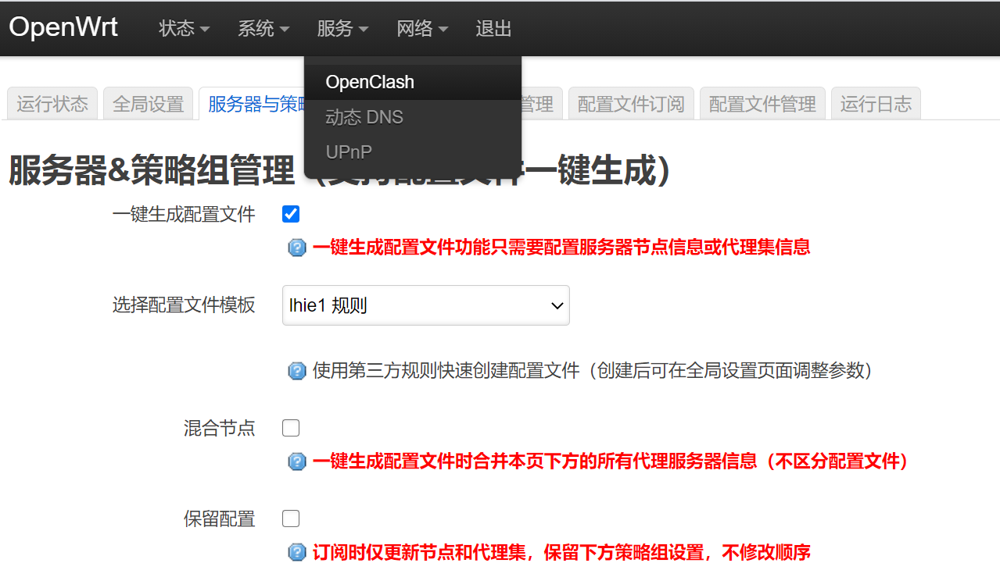

# OpenWRT配置

本文主要是用作个人的备忘，只是简单讲顺序，省略了很多具体步骤。

需要在一个已经可以联网，且最好已经有透明代理的环境下操作。配置完成后让OpenWRT作为主路由。


## 安装

下载最新固件 openwrt-19.07.7-x86-64-combined-squashfs.img.gz 解压出img

https://downloads.openwrt.org/releases

如果是虚拟机安装，要设置虚拟硬件网卡，不要用virtio


## 联网

```bash
# 修改网卡参数，使其能联网
vim /etc/config/network
# 主要改下面几个参数，网关和DNS指向路由器，IP地址和子网掩码根据当前网络配置
# config interface 'lan'
#   option ipaddr '192.168.5.5'
#   option gateway '192.168.5.2'
#   list dns '192.168.5.2'
/etc/init.d/network restart

# 给openwrt开启透明代理，方便后续步骤进行。
# 如果没有代理可以手动下载ipk包安装，但是太繁琐了。

# ssh连接openwrt
```


## 安装App

安装App

- luci-i18n-base-zh-cn
- wget with https support
- openclash
- wrtbwmon
- miniupnp
- ddns godaddy


```bash
# install Apps
opkg update
opkg list-upgradable | cut -f 1 -d ' ' | xargs opkg upgrade

# i18n, wget, openclash deps, mini-upnp, ddns godaddy
opkg install luci-i18n-base-zh-cn wget ca-certificates coreutils-nohup bash iptables curl jsonfilter ca-certificates ipset ip-full iptables-mod-tproxy iptables-mod-extra ruby ruby-yaml miniupnpd luci-app-upnp luci-app-ddns luci-i18n-ddns-zh-cn ddns-scripts_godaddy.com-v1

# replace dnsmasq to dnsmasq-full
opkg remove dnsmasq && opkg install dnsmasq-full

mkdir /tmp/ipk && cd /tmp/ipk

# libcap and libcap-bin should be same version
wget https://downloads.openwrt.org/snapshots/packages/x86_64/packages/libcap_2.43-1_x86_64.ipk
wget https://downloads.openwrt.org/snapshots/packages/x86_64/packages/libcap-bin_2.43-1_x86_64.ipk

# download latest releases from here
# https://github.com/vernesong/OpenClash/releases
# https://github.com/pyrovski/wrtbwmon/releases
# https://github.com/Kiougar/luci-wrtbwmon/releases
wget https://github.com/vernesong/OpenClash/releases/download/v0.42.03-beta/luci-app-openclash_0.42.03-beta_all.ipk
wget https://github.com/pyrovski/wrtbwmon/releases/download/0.36/wrtbwmon_0.36_all.ipk
wget https://github.com/Kiougar/luci-wrtbwmon/releases/download/v0.8.3/luci-wrtbwmon_v0.8.3_all.ipk

opkg install *.ipk
cd /tmp && rm -rf ipk

/etc/init.d/wrtbwmon enable
/etc/init.d/wrtbwmon start

# clear luci cache if entered luci before
# rm /tmp/luci-indexcache

# set root password, default is openwrt
passwd root
reboot
```


## 接口配置

登录Luci后台

1、单臂路由拨号配置

- WAN口：绑定到eth0，设置PPPOE，取消勾选桥接，建议取消IPV6。
- LAN口：绑定到eth0，取消勾选桥接，开启DHCP。LAN口的网关留空，默认会指向WAN口IP。

2、单臂路由做旁路网关的配置（旁路网关只能单网口桥接）

- LAN口：绑定到eth0，桥接，强制DHCP，禁用IPV6的DHCP。LAN口的网关指向主路由，IP和主路由在一个网段。

3、多网口路由拨号配置

- 和上面相同，但是WAN和LAN口分别绑定到不同的物理端口。


### 检查网络情况

使用ping和curl分别检查IP和域名能否访问

```bash
ping 8.8.8.8
crul baidu.com
```

如果网站打不开但是IP可以ping通，尝试修改DHCP/DNS中的DNS参数。

启动OpenClash可以访问国外，但是不能访问国内网络，尝试 网络 --> 防火墙 --> 自定义规则，添加如下并重启防火墙

```bash
iptables -t nat -I POSTROUTING -j MASQUERADE
```

http://blog.sinovale.com/2570.html


## 配置OpenClash

配置OpenClash

1. 全局设置 - 版本更新，更新内核
2. 服务器与策略组管理，添加服务器节点，一键生成配置文件，选择lhie1规则
3. 全局设置 - 模式设置，Redir-Host模式
4. 应用设置，查看OpenClash连接状态

OpenWRT - 网络 - DHCP/DNS中，DNS转发添加OpenClash的DNS服务 `127.0.0.1#7874`

检查网络


```bash
curl www.google.com
```





## 配置UPNP、DDNS、防火墙

https://oldwiki.archive.openwrt.org/doc/howto/upnp


