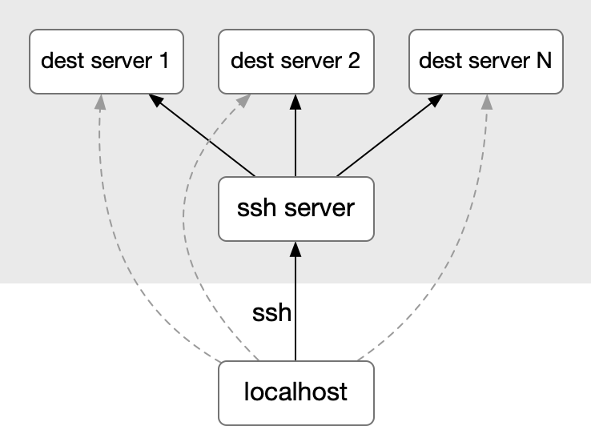
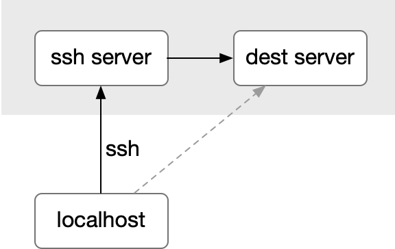
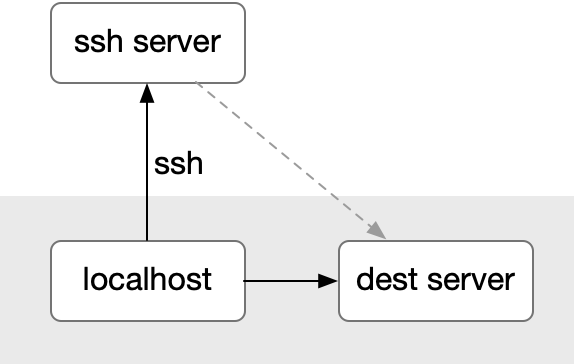

# SSH相关


## 远程登录

```bash
ssh user@host -p PORT -i IDENTITY_FILE
```


## 远程操作

```bash
# 将本机公钥添加到远程主机中
ssh user@host 'mkdir -p .ssh cat >> .ssh/authorized_keys' < ~/.ssh/id_rsa.pub
```


## SSH隧道 (ssh tunnel)

### 动态端口转发（Socks代理服务器）



localhost通过ssh server连接动态指定的dest server。
- 此时ssh server充当Socks代理服务器。
- ssh隧道中可以传输Socks5协议。

```bash
ssh -D [LOCAL_IP:]LOCAL_PORT [USER@]SSH_SERVER
```

举例：将远程主机设置为代理服务器，本机通过9090端口连接。

```bash
ssh -D 9090 -N -f user@remote.host
```

### 本地端口转发



localhost通过ssh server连接到dest server。

- localhost不能直连dest server。可能是安全原因，也可能是因为在内网。
- ssh server可直连dest server且无需加密，两者可能在同一台机器上。

```bash
ssh -L [LOCAL_IP:]LOCAL_PORT:DESTINATION:DESTINATION_PORT [USER@]SSH_SERVER
```

举例：SSH服务器上装了VNC/MySQL，端口为5901。

- 因为VNC/MySQL协议没有加密，本机直连服务器5901端口不安全。
- 服务器防火墙没开放5901端口，但是开放了SSH的22端口。

此时可以建立隧道，将本机5901通过SSH隧道转发到服务器自身的5901。之后连接本机5901端口就可以连接VNC/MySQL。

```bash
ssh -L 5901:localhost:5901 -N -f user@ssh-server.com
```

### 远程端口转发（内网穿透）



ssh server通过localhost连接到dest server。

- ssh server不能直连dest server。
- localhost可直连dest server且不需加密，两者可能在同一台机器上。

```bash
ssh -R [REMOTE:]REMOTE_PORT:DESTINATION:DESTINATION_PORT [USER@]SSH_SERVER
```

举例：本机3000端口部署了开发中的Web程序，没有公网IP，外网不能访问。

此时可以建立隧道，将SSH服务器的8080端口转发到本机的3000端口。之后连接SSH服务器8080端口就可以访问本机Web程序。

说明：

1. ssh server防火墙需要打开8080端口。
2. ssh server需要修改 `/etc/ssh/sshd_config` 配置项 `GatewayPorts clientspecified` 并重启sshd服务。
3. ssh server指定端口`0.0.0.0`允许来自所有IP的访问，不指定则只能从ssh server本机访问。
4. 参数 `-o ServerAliveInterval=240` 用于定时发消息保持ssh连接。

```bash
ssh -R 0.0.0.0:8080:localhost:3000 -N -f user@ssh-server.com -o ServerAliveInterval=240
```


### SSH隧道小结

常用参数

```bash
-D  # 动态代理 
-L  # 本地端口转发
-R  # 远程端口转发

-N  # 不执行远程命令，只做端口转发
-f  # 在后台执行
```

进程管理

```bash
# 查看ssh隧道进程
ps aux | grep PORT
# or
ps aux | grep ssh

# 断开ssh隧道
kill PID
# or
pkill ssh
```

参考

https://www.myfreax.com/how-to-setup-ssh-tunneling/

https://www.ruanyifeng.com/blog/2011/12/ssh_port_forwarding.html

https://segmentfault.com/a/1190000020766229


