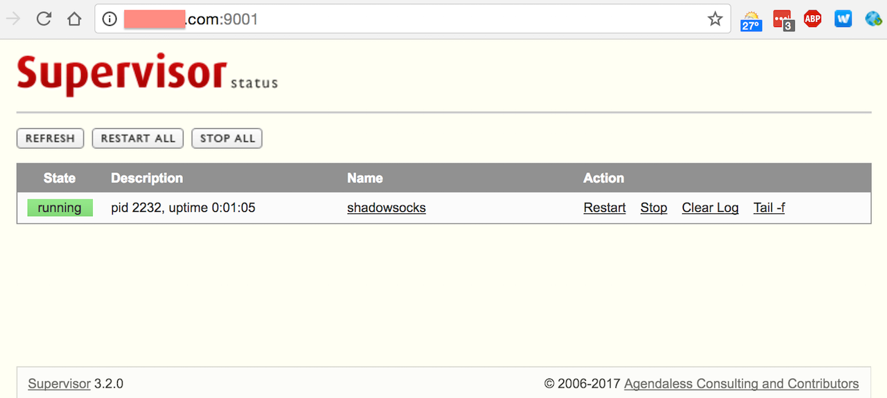

# Supervisor


Supervisor是一款用Python实现的进程管理工具，可用于在后台以Daemon模式运行进程，并能在异常时自动重启。例如可以用Supervisor管理Shadowsocks、node、nginx等。


## 安装

```bash
sudo apt-get install supervisor
```

注意：用apt安装一般可以开机自启动，用pip安装则需要自己配置。


## 配置应用

在`/etc/supervisor/conf.d/`文件夹下创建`conf`文件，一个文件对应一个应用。

```bash
cd /etc/supervisor/conf.d/
vim app.conf
```

```bash
[program:app]       # 应用的名字
command=/root/xxx   # 执行的命令
directory=/root/    # 进程当前目录
user=root           # 执行用户，可以是nobody
priority=1          # 优先级
numprocs=1          # 启动的进程数目
autostart=true      # 随supervisor同时启动
autorestart=true    # 出错重启
```

例如ShadowSocks的配置`/etc/supervisor/conf.d/shadowsocks.conf`

```bash
[program:shadowsocks]
command=ssserver -c /etc/shadowsocks.json
autorestart=true
user=nobody
```


## 常用操作

```bash
# supervisor自身的启动
service supervisor start/stop/restart
# 管理应用
supervisorctl start/stop/restart app
# 管理groupworker分组的应用
supervisorctl start/stop/restart groupworker
# 管理所有应用
supervisorctl start/stop/restart all
# 载入配置文件，按新配置重启所有进程，没改动的也会重启
supervisorctl reload
# 载入配置文件，按新配置重启有改动/新的进程，没改动的不重启
supervisorctl update
# 注1：start、restart、stop都不会载入最新的配置文件
# 注2：显式用stop停止掉的进程，用reload或者update都不会自动重启
```

如果启动supervisor服务时出现以下错误，可输入`sudo unlink /tmp/supervisor.sock`，再尝试启动。

> Error: Another program is already listening on a port that one of our HTTP servers is configured to use. Shut this program down first before starting supervisord.


## 全局配置文件

配置文件：`/etc/supervisor/supervisord.conf`

```bash
root@xxx:/etc/supervisor# cat supervisord.conf
; supervisor config file
[unix_http_server]
file=/var/run/supervisor.sock   ; (the path to the socket file)
chmod=0700                       ; sockef file mode (default 0700)
[supervisord]
logfile=/var/log/supervisor/supervisord.log ; (main log file;default $CWD/supervisord.log)
pidfile=/var/run/supervisord.pid ; (supervisord pidfile;default supervisord.pid)
childlogdir=/var/log/supervisor            ; ('AUTO' child log dir, default $TEMP)
; the below section must remain in the config file for RPC
; (supervisorctl/web interface) to work, additional interfaces may be
; added by defining them in separate rpcinterface: sections
[rpcinterface:supervisor]
supervisor.rpcinterface_factory = supervisor.rpcinterface:make_main_rpcinterface
[supervisorctl]
serverurl=unix:///var/run/supervisor.sock ; use a unix:// URL  for a unix socket
; The [include] section can just contain the "files" setting.  This
; setting can list multiple files (separated by whitespace or
; newlines).  It can also contain wildcards.  The filenames are
; interpreted as relative to this file.  Included files *cannot*
; include files themselves.
[include]
files = /etc/supervisor/conf.d/*.conf
```


## 配置Web后台

可在全局配置文件中添加下面的内容，配置Supervisor的Web后台，查看状态、进行操作。

其中port用`127.0.0.1:9001`表示仅主机自身通过9001端口可访问，使用`*`则表示任意IP通过9001端口可访问。

```bash
[inet_http_server]         ; inet (TCP) server disabled by default
port=127.0.0.1:9001        ; (ip_address:port specifier, *:port for all iface)
username=admin             ; (default is no username (open server))
password=123               ; (default is no password (open server))
```

云主机上配置port为`*:9001`，重启supervisor服务，从浏览器访问主机的9001端口，输入用户名密码即可打开Web后台，如图。




## 配置开机启动

一般使用apt安装的Supervisor默认即可开机启动。如果不能启动，或是使用pip安装的，可以参考下面的文章创建脚本并执行相应命令
http://blog.csdn.net/shanliangliuxing/article/details/15499891

对于Ubuntu 16.04，如果开机不能自启动，可以尝试StackOverFlow上的回答，执行如下命令：

```bash
sudo systemctl enable supervisor
```

> You need to execute the command for starting a service at system up. For systemd on Ubuntu 16.04, this would be:
>
> sudo systemctl enable supervisor


## 参考

ubuntu部署shadowsocks
 https://www.chedanji.com/ubuntu-shadowsocks/

supervisor安装部署文档和管理实例
 http://blog.csdn.net/shanliangliuxing/article/details/15499891

Ubuntu 14.04下进程管理工具supervisor安装
 http://lambda.hk/nginx/2015/05/01/nginx-supervisor/

使用supervisor进行进程监控和自启动管理
 https://3rgb.com/entry/daemon_control_autostart_with_supervisor

Supervisor doesn't start on startup on Ubuntu 16.04
 http://stackoverflow.com/questions/38551851/supervisor-doesnt-start-on-startup-on-ubuntu-16-04
