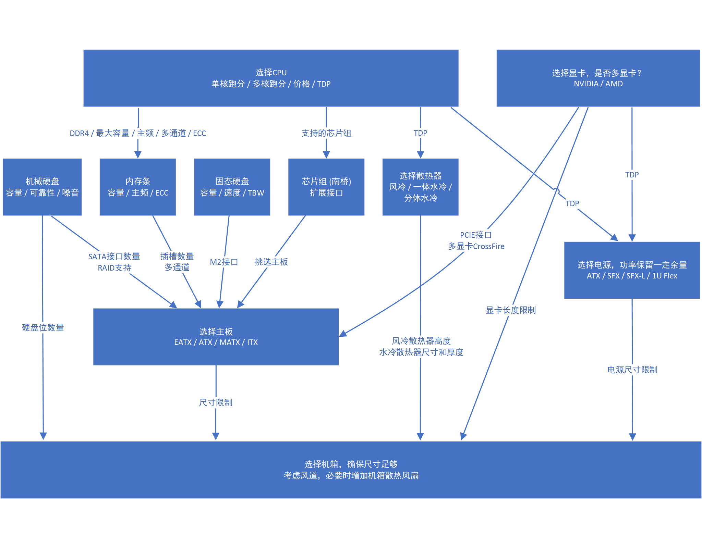
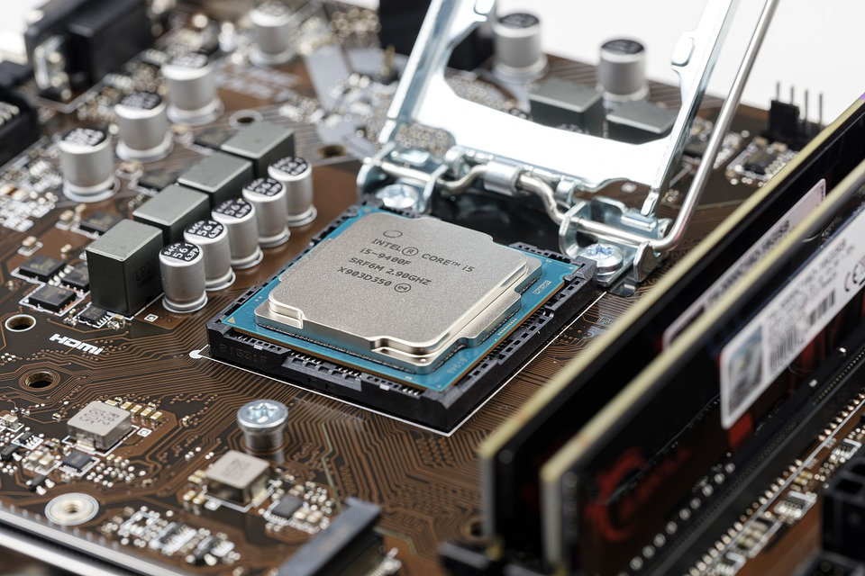
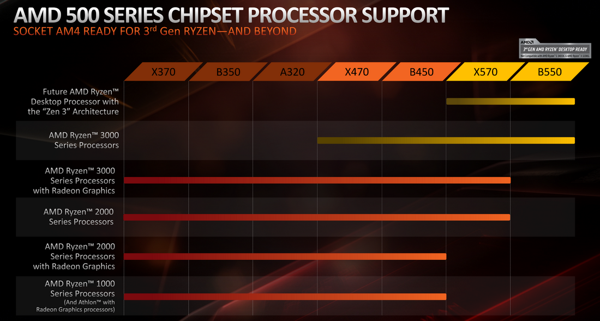
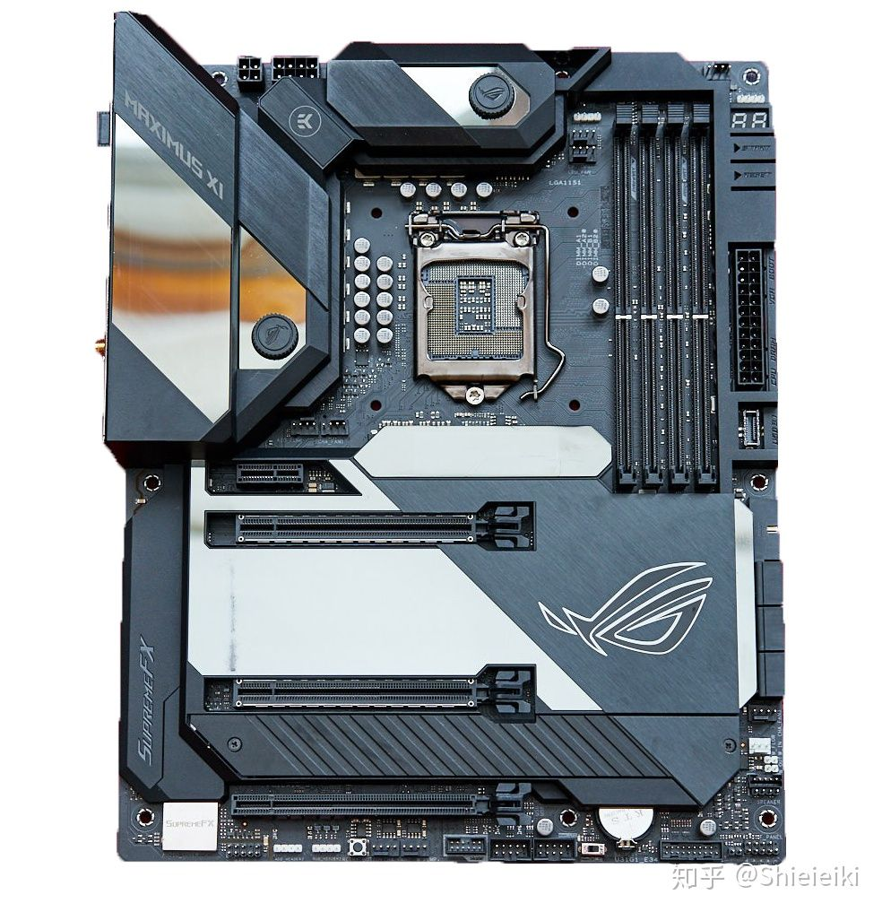
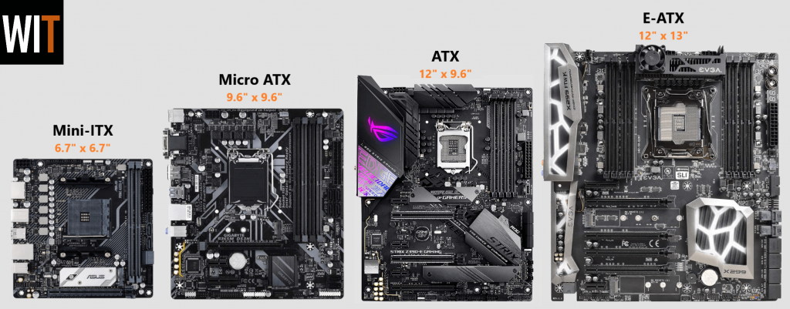
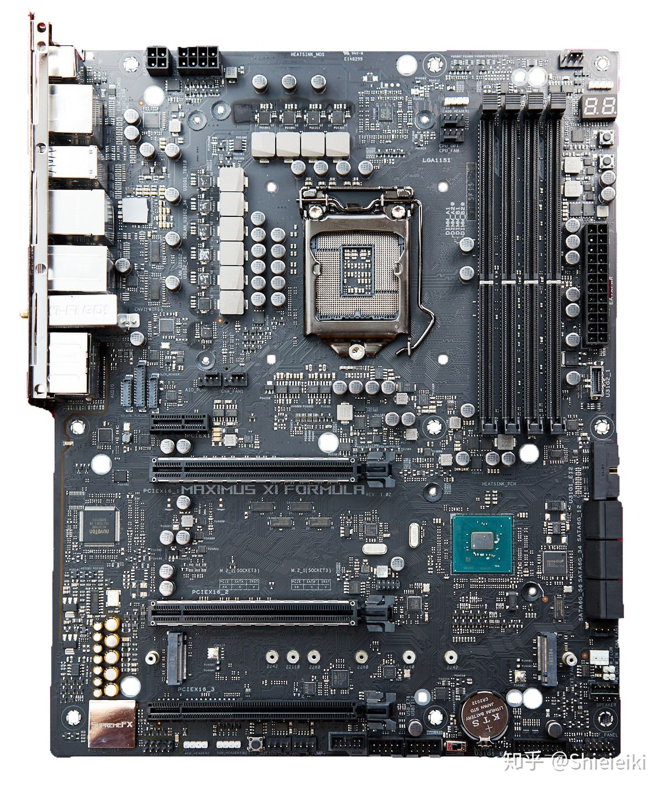
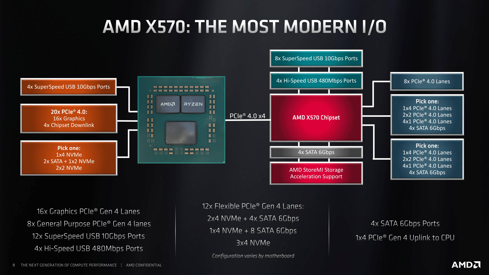
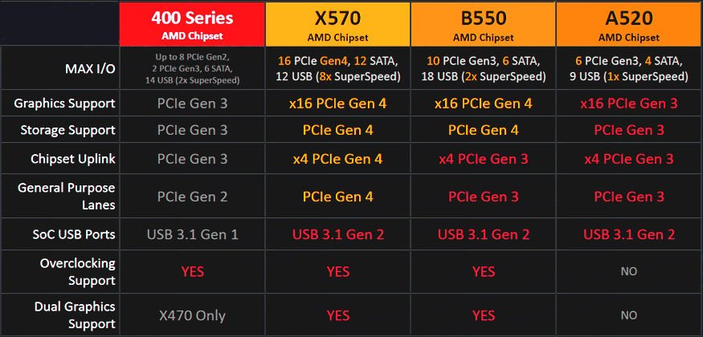
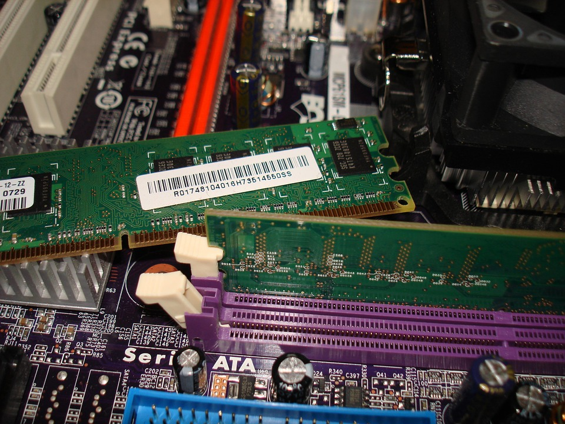

# 台式机知识整理

这篇文章尝试较为系统的介绍台式机组装相关的知识，**如有错误请及时指正**。

文中具体的产品推荐、接口标准仅适用于2021年，之后更新情况又会不一样了。

部分内容仅针对专业玩家，例如程序员、硬件从业者，看不明白可以跳过。

## 台式机基本部件

台式机主机通常包括这8个部件：

1. 主板
2. CPU
3. 内存
4. 硬盘
5. 显卡
6. 电源
7. 散热
8. 机箱

另外还有一些必要的外设：

1. 显示器
2. 键盘
3. 鼠标

## 购买台式机方案

方案

1. 知名品牌整机
2. 整机成品
3. 找人组装
4. 自己组装

分析

1. 整机有可能会为了追求性价比，在电源、散热、机箱等不起眼的地方偷工减料，可能会影响电脑的稳定性、可靠性。
2. 组装的问题在于需要了解很多相关知识，需要花费不少时间精力，且对动手能力有一定要求。还有配件选购不对需要退换货、操作失误损坏配件的风险。
3. 商家直接给你组装的一个好处是，商家通过专门的渠道可以拿到较低价格的配件。如果是完全自己买配件组装，从官网、京东等较正规的渠道购买配件成本偏高，从淘宝等渠道购买优惠配件则需要一定的经验，并且要承担潜在风险。

结论

- 普通用户可以考虑知名品牌整机。
- 对电脑有较高定制化要求又不方便自己组装的人，可以提需求让靠谱的店家帮忙组装，或者买整机成品，让懂行的朋友帮忙大概看看。
- 高端玩家、喜欢折腾的用户可以自己组装，享受DIY的乐趣，以及实现对台式机更加苛刻的需求。

## 台式机组装基本步骤

参考下面示意图

 

## 中央处理器 / CPU

### 跑分

CPU跑分是衡量CPU性能的主要依据。

这个网站有各种CPU的跑分数据，可以作为统一标准大致参考：https://www.cpubenchmark.net/

CPU主要有多核跑分和单核跑分两种。

- 大部分情况下，单核跑分2w的单核CPU（2w * 1），要优于单核跑分1w的双核CPU（1w * 2），因为程序中的不少操作不支持多核，且CPU任务拆分到多核再合并的操作要消耗额外资源。

- 举例来说，Python默认只能使用单核；一些程序利用多线程、多进程，可以同时使用CPU多核心运算，例如Java中的 `ForkJoinPool`。

### TDP

TDP = Thermal Design Power，热设计功耗。保证CPU稳定工作在标称频率上，需要排出多少热量。

了解TDP的主要作用是大致了解其功耗和散热需求。

CPU在超频情况下，实际功率会超过TDP。

https://zh.wikipedia.org/wiki/%E7%83%AD%E8%AE%BE%E8%AE%A1%E5%8A%9F%E8%80%97

### 品牌

主要是Intel和AMD

- 目前来看，AMD最新的7nm CPU，在价格、性能、功耗、接口上均有一定优势。
- Mac系统对Intel CPU兼容更好。如果有黑苹果需求，优先考虑Intel。
- Intel CPU的插座经常升级，不兼容旧版。好处是可以随时升级到最新技术提高性能，坏处是升级CPU需要同时升级主板。AMD的接口则是更久才更换一次。

### 其他

架构 / 制程 / 核心数 / 线程数 / 主频：可以自行学习

### 购买

由于CPU是高科技产品，造假几乎不可能，且CPU在正常使用情况下寿命很长难以损坏，所以购买不用太担心，挑便宜的买都可以。一般可以选择 CPU+主板 套装，会有一定优惠。

关于盒装与散片：CPU的散片与盒装的区别？散片一般哪来的？质量与盒装有区别吗？ - 知乎 https://www.zhihu.com/question/50763446

图片来自 [Cpu Processor Chip - Free photo on Pixabay](https://pixabay.com/photos/cpu-processor-chip-motherboard-4393376/)

## 芯片组 / Chipset / PCH / FCH 简介

- **CPU确定后可以找到支持这款CPU的芯片组，从而进一步确定主板型号。**

- 这里芯片组主要指**南桥芯片**。早期主板上有南桥芯片和北桥芯片，但是后来北桥芯片的功能都被集成到CPU内部了，只剩下南桥芯片。

- 芯片组相当于一个Hub，负责协助CPU和相对低速的设备通信。
- Intel CPU的芯片组又叫PCH，AMD CPU的芯片组又叫FCH。

- **台式机的扩展性主要就取决于CPU+芯片组+主板。**

[芯片组 - 维基百科，自由的百科全书 (wikipedia.org)](https://zh.wikipedia.org/wiki/芯片组)

下面是一个AMD CPU系列和芯片组支持情况的示意图：

## 主板 / Motherboard

主板用于安装和连接台式机上绝大多数配件。主板如下图示例。

再次说明：CPU确定后可以找到支持这款CPU的芯片组，从而进一步确定主板型号。

### 品牌

- 公认一线品牌：华硕 Asus、技嘉 Gigabyte、微星 MSI（均为台湾企业）
- 其他：七彩虹，华擎，昂达，翔升，铭瑄，梅捷，磐正，捷波，精英等

### 尺寸

主板尺寸主要取决于主板的高度。常见尺寸从大到小排列有：

- E-ATX / Extended ATX：一般用于服务器、工作站、高端机器，支持大尺寸CPU（例如Intel Xeon系列，AMD ThreadRipper系列）或双CPU，8个内存插槽。
- ATX：标准的台式机主板，一般支持单个CPU，4个内存插槽，7个PCIe接口位置（实际放置3~5个PCIe接口）。
- MATX / Micro ATX：稍小一点的主板，主要比ATX少PCIe接口，5个PCIe接口位置（实际放置2~4个PCIe接口）。虽然和ATX相差不大，但是各品牌高端主板MATX的比较少。
- ITX / Mini-ITX：一般是正方形，支持2个内存插槽，1~2个PCIe接口，可以组装A4尺寸的迷你小电脑。

就目前来看：

- 需要128G内存（32Gx4），选MATX以上
- 需要双GPU，MATX以上，最好ATX以上
- 普通用户不建议E-ATX，价格太贵
- 需要小巧可以选ITX，牺牲一些性能

[The Complete Guide to Motherboard Sizes - EATX vs ATX vs Micro ATX vs Mini ITX - What in Tech](https://whatintech.com/motherboard-size-guide/)

[【华硕Z87评测】尺寸不会再乱 主板板型规格知识大解析（全文）_主板评测-中关村在线 (zol.com.cn)](https://mb.zol.com.cn/438/4384423_all.html)

### 不同主板区别

- 供电
- 做工
- 主板集成功能：集成显卡、声卡、Wifi、蓝牙等
- 接口
- 外观

### 主板接口以及关键点

1. CPU插槽：根据CPU型号确定插槽，例如AMD的AM4。
2. 内存插槽：最大容量、双通道支持、ECC支持。
3. PCIe / PCI Express 插槽：PCIe数量，PCIe版本，PCIe通道分配，是否支持双显卡CrossFire。
4. 网口：传输速率和数量。例如多网口，2.5G/5G/10G高速网口。
5. M2 / SATA接口：数量，M2注意PCIe版本，是否直连CPU，以及支持M2硬盘的尺寸。
6. USB接口 / 前置USB接口：USB版本，数量，供电能力，TypeC。
7. 雷电口：台式机支持雷电口的很少，因为有PCIe接口，不太需要雷电，而且雷电设备成本高。
8. 风扇接口：主板自带的风扇接口，一般可以通过主板控制转速。
9. RGB接口：高端主板有RGB接口，可以驱动多个RGB信仰灯实现“神光同步”一类效果。

[【主板上各种接口和附属部件科普】 - 知乎 (zhihu.com)](https://zhuanlan.zhihu.com/p/53379889)

另外这里有个USB接口命名的介绍，很容易搞错

[你们熟悉的USB接口又双叒叕改名了...... - 知乎 (zhihu.com)](https://zhuanlan.zhihu.com/p/57817053)

以及这里提到了官方解释为什么会这样

[Confused by USB names? Get used to it as USB 3.1 becomes 3.2 - CNET](https://www.cnet.com/news/confused-by-usb-names-get-used-to-it-as-usb-3-1-becomes-3-2/)

### PCIe通道、PCIe接口

[PCI Express - 维基百科，自由的百科全书 (wikipedia.org)](https://zh.wikipedia.org/wiki/PCI_Express)

1. 简介：PCIe协议用于连接高速通信设备，CPU+芯片组决定了最大支持的PCIe通道数量和速率。
1. PCIe接口提供PCIe通道的连接，扩展性强，常用于显卡、固态硬盘、高速网卡等设备，也很容易买到基于PCIe的USB、声卡、SATA接口等各种扩展卡。图中的左下角水平放置的就是PCIe接口。除了PCIe插座，M2等接口也会占用PCIe通道。
1. 版本和兼容性：目前最新版本为PCIe 4.0。PCIe高版本和低版本插槽是兼容的，实际速率取决于插槽、设备谁的速度更低。
1. 传输速率：完整的PCIe接口包含16个通道，即PCIe x16。以PCIe 4.0为例，每个通道可以提供约16Gbps=2GB/s的原始速度，16通道原始总速度32GB/s，考虑到编码问题，实际速度31.5GB/s。**如果你需要接高速SSD、万兆网卡等设备，可能需要计算一下PCIe带宽。**
1. 通道和工作模式：外观是PCIe x16的插座，实际上可能插座里只有部分触点，工作在x16, x8, x4, x2, x1的模式下（速度会下降）。由于 CPU+芯片组 可以提供的PCIe通道数量有限，不同主板对PCIe通道的分配也不一样，有些还可以设置PCIe插座工作模式。我们甚至可以用胶带把PCIe x16的显卡插口右边部分触点贴起来，于是显卡就会工作在PCIe x1的模式下。

### 芯片组与扩展性

下图是AMD X570芯片组的示意图，CPU通过高速接口PCIe连接X570，然后扩展出PCIe、USB、SATA等接口。下图可以看到，有24个直连CPU的PCIe 4.0，其中4个连接X570芯片组，芯片组又扩展出12个PCIe 4.0。

下面是一个AMD芯片组的参数对比表。**相同CPU搭配不同芯片组，最终扩展出的接口也不一样。再考虑主板对这些接口的利用情况，就基本确定了台式机的扩展性。**

### 主板的选择

最后总结一下主板的选择：

- 根据需要和预算，确定CPU，参考跑分。
- 根据需要和预算，确定芯片组。
- 根据尺寸、芯片组、品牌，查找符合条件的主板，可以参考网上的横评，以及内存、硬盘等其他配件的需求，确定主板。

[组装电脑哪个主板好？如何选择电脑主板？2021年电脑主板推荐及分析。 - 知乎 (zhihu.com)](https://zhuanlan.zhihu.com/p/158980353)

## 内存 / RAM

1. 容量：一般为2的次方，例如512MB, 1GB，2GB，8GB，32GB。目前主流单条内存容量主要有8G, 16G, 32G。
2. 规格：目前最新的是DDR4。**不同规格内存插槽不兼容**。
3. 频率：频率越高，内存读写越快。例如3200MHz，3600MHz。
4. 双通道：**在CPU和主板都支持的情况下**，两条内存组成双通道，CPU同时读写两条内存，读写速度变为双倍。消费级CPU一般支持双通道，更高级的CPU还可以支持四通道。组成双通道的两条CPU应该尽可能一致。在购买时会发现，**两条装套条比单条装买2条更贵**，网上的解释是，套装一般是相同批次生产，一致性会更好（但也不排除商家故意提高价格的嫌疑）。
5. ECC内存（Error-Correcting Code memory）：ECC内存通过增加奇偶校验位，自动进行纠错，从而提高了内存的可靠性，同时价格相对更高。ECC内存常用于服务器。ECC内存和普通内存插槽相同，但是**只有CPU、主板都支持的情况下才能用ECC内存**。一些CPU、主板同时支持普通内存和ECC内存。

图片来自 [Computer Hardware - Free photo on Pixabay](https://pixabay.com/photos/computer-computer-hardware-624558/)

## 固态硬盘 / SSD / Solid State Drive

## 机械硬盘 / HDD / Hard Drive

## 显卡 / Graphic Card

### 亮机卡

## 电源 / Power Supply

功率/金牌/转换效率/尺寸/接口

## 散热器

散热
风冷

水冷

CPU兼容性/风扇直径/类型/匹配机箱高度/内存限高

## 机箱 / PC Case

常见机箱结构，尺寸限制的计算

外观/接口/兼容性/尺寸/风道

主板类型
散热器限高
水冷尺寸
显卡限长限高
电源限长

## 安装

内存在安装时需要注意内存先后顺序以及双通道问题。例如4插槽主板，通常1和3、2和4分别组成两组双通道，且优先读取1和3这一组。如果只有2条内存，就应该插到1和3上。具体看主板上的标注和说明书。

具体的安装方法可以参考这篇文章的视频教程，配件说明书，还可以根据实际配件型号在网上找到各种视频。

[【装机教程】这可能是你能在网上找到最详细的装机教程 - 知乎 (zhihu.com)](https://zhuanlan.zhihu.com/p/91459238)

## 配置参考

### 1

CPU AMD 3950x + 主板 x570 Aorus Master 7399
内存 海盗船 DDR4 3600 32Gx2套装 2649
硬盘 西数 SN550 1T 729
水冷 海盗船 H150i ELITE 1449
电源 海韵 FOCUS GX1000 1299
机箱 爱国者 YOGO M2 PRO 269

合计 7399+2649+729+1449+1299+269=13794

显卡 GTX1080 拆机

