# 台式机知识整理

这篇文章尝试较为系统的介绍台式机组装相关的知识，**如有错误请及时指正**。

文中具体的产品推荐、接口标准仅适用于2021年，之后更新情况又会不一样了。

部分内容仅针对专业玩家，例如程序员、硬件从业者，看不明白可以跳过。

## 台式机基本部件

台式机主机通常包括这8个部件：

1. 主板
2. CPU
3. 内存
4. 硬盘
5. 显卡
6. 电源
7. 散热
8. 机箱

另外还有一些必要的外设：

1. 显示器
2. 键盘
3. 鼠标

## 购买台式机方案

方案

1. 知名品牌整机
2. 整机成品
3. 找人组装
4. 自己组装

分析

1. 整机有可能会为了追求性价比，在电源、散热、机箱等不起眼的地方偷工减料，可能会影响电脑的稳定性、可靠性。
2. 组装的问题在于需要了解很多相关知识，需要花费不少时间精力，且对动手能力有一定要求。还有配件选购不对需要退换货、操作失误损坏配件的风险。
3. 商家直接给你组装的一个好处是，商家通过专门的渠道可以拿到较低价格的配件。如果是完全自己买配件组装，从官网、京东等较正规的渠道购买配件成本偏高，从淘宝等渠道购买优惠配件则需要一定的经验，并且要承担潜在风险。

结论

- 普通用户可以考虑知名品牌整机。
- 对电脑有较高定制化要求又不方便自己组装的人，可以提需求让靠谱的店家帮忙组装，或者买整机成品，让懂行的朋友帮忙大概看看。
- 高端玩家、喜欢折腾的用户可以自己组装，享受DIY的乐趣，以及实现对台式机更加苛刻的需求。

## 台式机组装基本步骤

参考下面示意图

 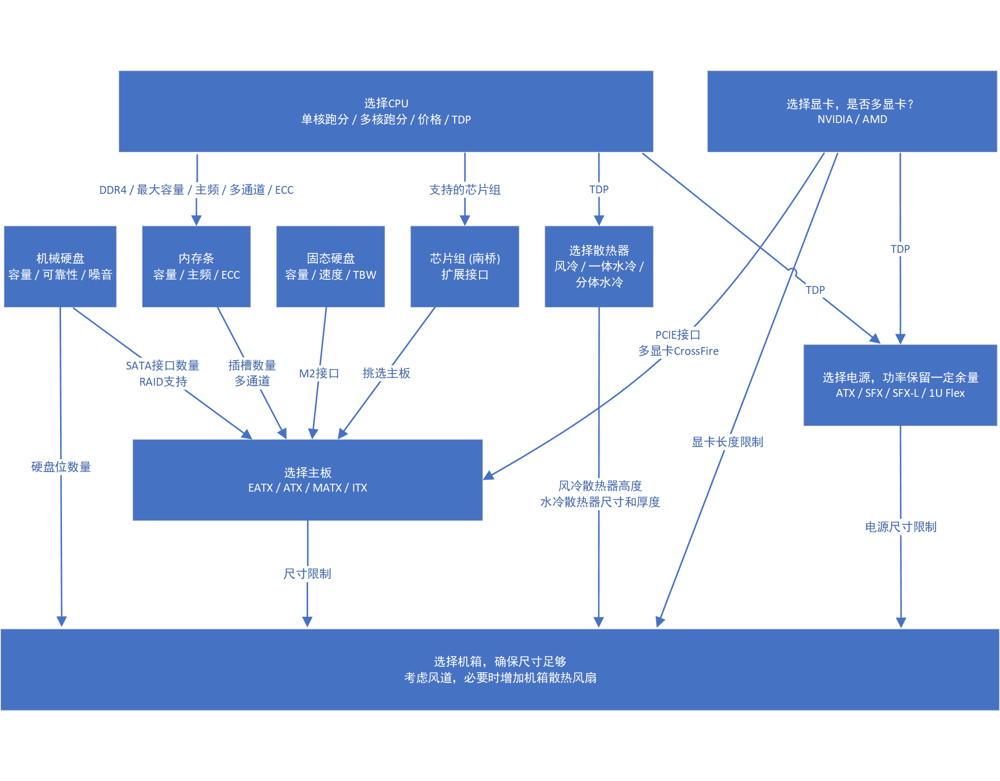

## 中央处理器 / CPU

### 跑分

CPU跑分是衡量CPU性能的主要依据。

这个网站有各种CPU的跑分数据，可以作为统一标准大致参考：https://www.cpubenchmark.net/

CPU主要有多核跑分和单核跑分两种。

- 大部分情况下，单核跑分2w的单核CPU（2w * 1），要优于单核跑分1w的双核CPU（1w * 2），因为程序中的不少操作不支持多核，且CPU任务拆分到多核再合并的操作要消耗额外资源。

- 举例来说，Python默认只能使用单核；一些程序利用多线程、多进程，可以同时使用CPU多核心运算，例如Java中的 `ForkJoinPool`。

### TDP

TDP = Thermal Design Power，热设计功耗。保证CPU稳定工作在标称频率上，需要排出多少热量。

了解TDP的主要作用是大致了解其功耗和散热需求。

CPU在超频情况下，实际功率会超过TDP。

https://zh.wikipedia.org/wiki/%E7%83%AD%E8%AE%BE%E8%AE%A1%E5%8A%9F%E8%80%97

### 品牌

主要是Intel和AMD

- 目前来看，AMD最新的7nm CPU，在价格、性能、功耗、接口上均有一定优势。
- Mac系统对Intel CPU兼容更好。如果有黑苹果需求，优先考虑Intel。
- Intel CPU的插座经常升级，不兼容旧版。好处是可以随时升级到最新技术提高性能，坏处是升级CPU需要同时升级主板。AMD的接口则是更久才更换一次。

### 其他

架构 / 制程 / 核心数 / 线程数 / 主频：可以自行学习

### 购买

由于CPU是高科技产品，造假几乎不可能，且CPU在正常使用情况下寿命很长难以损坏，所以购买不用太担心，挑便宜的买都可以。一般可以选择 CPU+主板 套装，会有一定优惠。

关于盒装与散片：CPU的散片与盒装的区别？散片一般哪来的？质量与盒装有区别吗？ - 知乎 https://www.zhihu.com/question/50763446

主板上的CPU。图片来源： [Cpu Processor Chip - Free photo on Pixabay](https://pixabay.com/photos/cpu-processor-chip-motherboard-4393376/)

## 芯片组 / Chipset / PCH / FCH

- **CPU确定后可以找到支持这款CPU的芯片组，从而进一步确定主板型号。**

- 这里芯片组主要指**南桥芯片**。早期主板上有南桥芯片和北桥芯片，但是后来北桥芯片的功能都被集成到CPU内部了，只剩下南桥芯片。

- 芯片组相当于一个Hub，负责协助CPU和相对低速的设备通信。
- Intel CPU的芯片组又叫PCH，AMD CPU的芯片组又叫FCH。

- **台式机的扩展性主要就取决于CPU+芯片组+主板。**

[芯片组 - 维基百科，自由的百科全书 (wikipedia.org)](https://zh.wikipedia.org/wiki/芯片组)

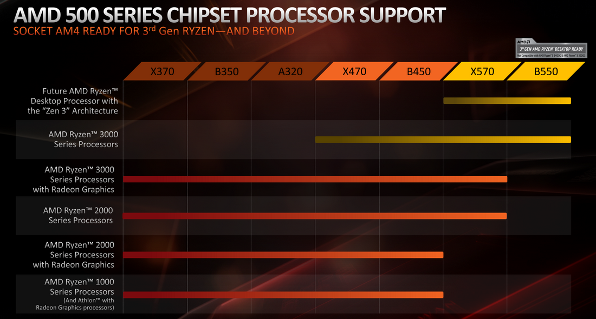

AMD芯片组对CPU的支持。图片来源：[AMD Chipset Comparison: B550 Specs vs. X570, B450, X370, & Zen 3 Support (2020) | GamersNexus - Gaming PC Builds & Hardware Benchmarks](https://www.gamersnexus.net/guides/3582-amd-chipset-differences-b550-vs-x570-b450-x470-zen-3)

## 主板 / Motherboard

主板用于安装和连接台式机上绝大多数配件。主板如下图示例。

再次说明：CPU确定后可以找到支持这款CPU的芯片组，从而进一步确定主板型号。

表面覆盖了大量散热片的高端主板。图片来源： [【主板上各种接口和附属部件科普】 - 知乎 (zhihu.com)](https://zhuanlan.zhihu.com/p/53379889)

### 品牌

- 公认一线品牌：华硕 Asus、技嘉 Gigabyte、微星 MSI（均为台湾企业）
- 其他：七彩虹，华擎，昂达，翔升，铭瑄，梅捷，磐正，捷波，精英等

### 尺寸

主板尺寸主要取决于主板的高度。常见尺寸从大到小排列有：

- E-ATX / Extended ATX：一般用于服务器、工作站、高端机器，支持大尺寸CPU（例如Intel Xeon系列，AMD ThreadRipper系列）或双CPU，8个内存插槽。
- ATX：标准的台式机主板，一般支持单个CPU，4个内存插槽，7个PCIe接口位置（实际放置3~5个PCIe接口）。
- MATX / Micro ATX：稍小一点的主板，主要比ATX少PCIe接口，5个PCIe接口位置（实际放置2~4个PCIe接口）。虽然和ATX相差不大，但是各品牌高端主板MATX的比较少。
- ITX / Mini-ITX：一般是正方形，支持2个内存插槽，1~2个PCIe接口，可以组装A4尺寸的迷你小电脑。

就目前来看：

- 需要128G内存（32Gx4），选MATX以上
- 需要双GPU，MATX以上，最好ATX以上
- 普通用户不建议E-ATX，价格太贵
- 需要小巧可以选ITX，牺牲一些性能

不同尺寸的主板。图片来源： [The Complete Guide to Motherboard Sizes - EATX vs ATX vs Micro ATX vs Mini ITX - What in Tech](https://whatintech.com/motherboard-size-guide/)

[【华硕Z87评测】尺寸不会再乱 主板板型规格知识大解析（全文）_主板评测-中关村在线 (zol.com.cn)](https://mb.zol.com.cn/438/4384423_all.html)

### 不同主板区别

- 供电
- 做工
- 主板集成功能：集成显卡、声卡、Wifi、蓝牙等
- 接口
- 外观

### 主板接口以及关键点

1. CPU插槽：根据CPU型号确定插槽，例如AMD的AM4。
2. 内存插槽：最大容量、双通道支持、ECC支持。
3. PCIe / PCI-E / PCI Express 插槽：PCIe数量，PCIe版本，PCIe通道分配，是否支持双显卡Cross Fire。
4. 网口：传输速率和数量。例如多网口，2.5G/5G/10G高速网口。
5. M2 / SATA接口：数量，M2注意PCIe版本，是否直连CPU，以及支持M2硬盘的尺寸。
6. USB接口 / 前置USB接口：USB版本，数量，供电能力，Type C。
7. 雷电口：台式机支持雷电口的很少，因为有PCIe接口，不太需要雷电，而且雷电设备成本高。
8. 风扇接口：主板自带的风扇接口，一般可以通过主板控制转速。
9. RGB接口：高端主板有RGB接口，可以驱动多个RGB信仰灯实现“神光同步”一类效果。

推荐看这篇文章： [【主板上各种接口和附属部件科普】 - 知乎 (zhihu.com)](https://zhuanlan.zhihu.com/p/53379889)

另外这里有个USB接口命名的介绍，很容易搞错

[你们熟悉的USB接口又双叒叕改名了...... - 知乎 (zhihu.com)](https://zhuanlan.zhihu.com/p/57817053)

以及这里提到了官方解释为什么会这样

[Confused by USB names? Get used to it as USB 3.1 becomes 3.2 - CNET](https://www.cnet.com/news/confused-by-usb-names-get-used-to-it-as-usb-3-1-becomes-3-2/)

### PCIe通道与PCIe接口

[PCI Express - 维基百科，自由的百科全书 (wikipedia.org)](https://zh.wikipedia.org/wiki/PCI_Express)

[深入PCI与PCIe之一：硬件篇 - 知乎 (zhihu.com)](https://zhuanlan.zhihu.com/p/26172972)

[PCI-Express 接口供电能力详解 - 开文日志 (nomox.cn)](https://www.nomox.cn/post/pcie-power-supply-ability/)

[小科普 | PCIe通道到底怎么算？_电脑配件_什么值得买 (smzdm.com)](https://post.smzdm.com/p/a3gw3zdd/)

1. 简介：PCIe协议用于连接高速通信设备，CPU+芯片组决定了最大支持的PCIe通道数量和速率。PCIe通道可以连接到PCIe、M.2 NVMe等接口上。
1. PCIe接口：扩展性强，常用于显卡、固态硬盘、高速网卡等设备，也很容易买到基于PCIe的USB、声卡、SATA接口等各种扩展卡。图中的左下角水平放置的就是PCIe接口。
1. 供电：PCIe接口本身可以提供最大75W供电。显卡等高功耗设备需要从电源连接单独的供电线。
1. 版本和兼容性：目前最新版本为PCIe 4.0。PCIe高版本和低版本插槽是兼容的，实际速率取决于插槽、设备谁的速度更低。
1. 传输速率：完整的PCIe接口包含16个通道，即PCIe x16。以PCIe 4.0为例，每个通道可以提供约16Gbps=2GB/s的原始速度，16通道原始总速度32GB/s，考虑到编码问题，实际速度31.5GB/s。**如果你需要接高速SSD、万兆网卡等设备，可能需要计算一下PCIe带宽。**
1. 通道和工作模式：外观是PCIe x16的插座，实际上可能插座里只有部分触点，工作在x16, x8, x4, x2, x1的模式下（速度会下降）。由于 CPU+芯片组 可以提供的PCIe通道数量有限，不同主板对PCIe通道的分配也不一样，有些主板还可以设置PCIe拆分。我们甚至可以用胶带把PCIe x16的显卡插口右边部分触点贴起来，于是显卡就会工作在PCIe x1的模式下。
1. PCIe扩展：可以使用南桥芯片/主板板载PLX芯片，将PCIe通道拆分出更多PCIe接口（类似USBHub），可以连接更多设备但是总速率不变。对速度要求高的显卡等设备最好插在直连CPU的PCIe插槽上（一般也就是最靠近CPU的PCIe接口）。

主板上的PCI-E接口。图片来源： [【主板上各种接口和附属部件科普】 - 知乎 (zhihu.com)](https://zhuanlan.zhihu.com/p/53379889)

左下方4个横向插座都是PCI-E接口。

- 第一个主板上标注了PCIEx1、比较短的是PCI-E x1。
- 第二个主板上标注了PCIEx16_1、带金属加固的是PCI-E x16。
- 第三个主板上标注了PCIEx16_2，虽然是PCI-E x16的样子，实际上是PCI-E x8，因为可以看到插座右边金属触点有缺失。
- 第四个主板上标注了PCIEx16_3，同理，其实是PCI-E x4。

### 芯片组与扩展性

下图是AMD X570芯片组的示意图，CPU通过高速接口PCIe连接X570，然后扩展出PCIe、USB、SATA等接口。下图可以看到，有24个直连CPU的PCIe 4.0，其中4个连接X570芯片组，芯片组又扩展出12个PCIe 4.0。

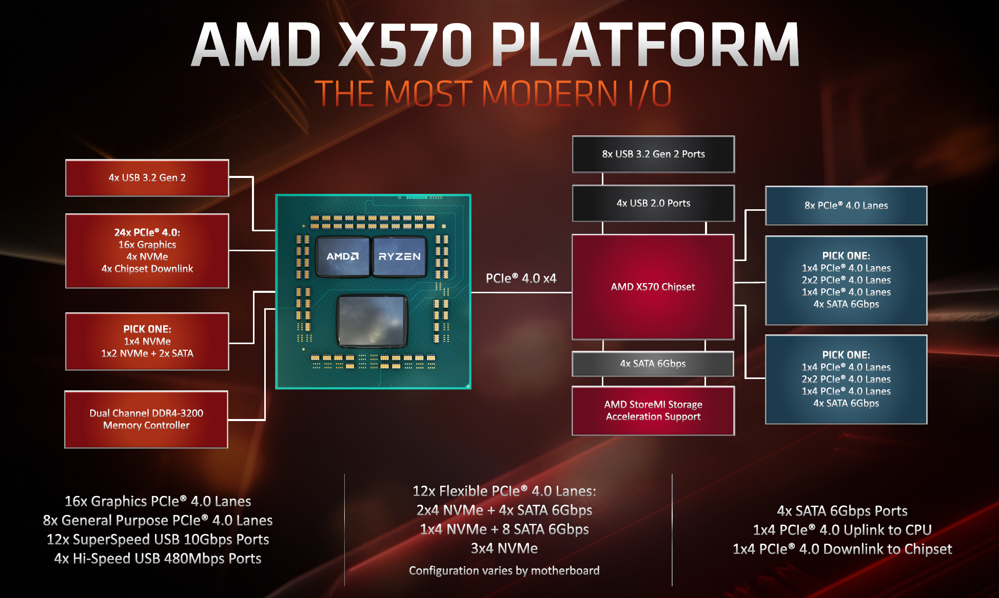

图片来源： [The AMD X570 Motherboard Overview: Over 35+ Motherboards Analyzed (anandtech.com)](https://www.anandtech.com/show/14161/the-amd-x570-motherboard-overview)

**相同CPU搭配不同芯片组，最终扩展出的接口也不一样。再考虑主板对这些接口的利用情况，就基本确定了台式机的扩展性。**

AMD芯片组的参数对比表。图片来源： [ASRock releases AMD A520 Motherboards with support to latest AMD Desktop Processors | Kanto Tech](https://kantotech.ph/2020/08/asrock-releases-amd-a520-motherboards-with-support-to-latest-amd-desktop-processors/)

### 主板的选择

最后总结一下主板的选择：

- 根据需要和预算，确定CPU，参考跑分。
- 根据需要和预算，确定芯片组。
- 根据尺寸、芯片组、品牌，查找符合条件的主板，可以参考网上的横评，以及内存、硬盘等其他配件的需求，确定主板。

[组装电脑哪个主板好？如何选择电脑主板？2021年电脑主板推荐及分析。 - 知乎 (zhihu.com)](https://zhuanlan.zhihu.com/p/158980353)

## 内存 / RAM

1. 容量：一般为2的次方，例如512MB, 1GB，2GB，8GB，32GB。目前主流单条内存容量主要有8G, 16G, 32G。
2. 规格：目前最新的是DDR4。**不同规格内存插槽不兼容**。
3. 频率：频率越高，内存读写越快。例如3200MHz，3600MHz。
4. 双通道：**在CPU和主板都支持的情况下**，两条内存组成双通道，CPU同时读写两条内存，读写速度变为双倍。消费级CPU一般支持双通道，更高级的CPU还可以支持四通道。组成双通道的两条CPU应该尽可能一致。在购买时会发现，**两条装套条比单条装买2条更贵**，网上的解释是，套装一般是相同批次生产，一致性会更好（但也不排除商家故意提高价格的嫌疑）。
5. ECC内存（Error-Correcting Code memory）：ECC内存通过增加奇偶校验位，自动进行纠错，从而提高了内存的可靠性，同时价格相对更高。ECC内存常用于服务器。ECC内存和普通内存插槽相同，但是**只有CPU、主板都支持的情况下才能用ECC内存**。一些CPU、主板同时支持普通内存和ECC内存。

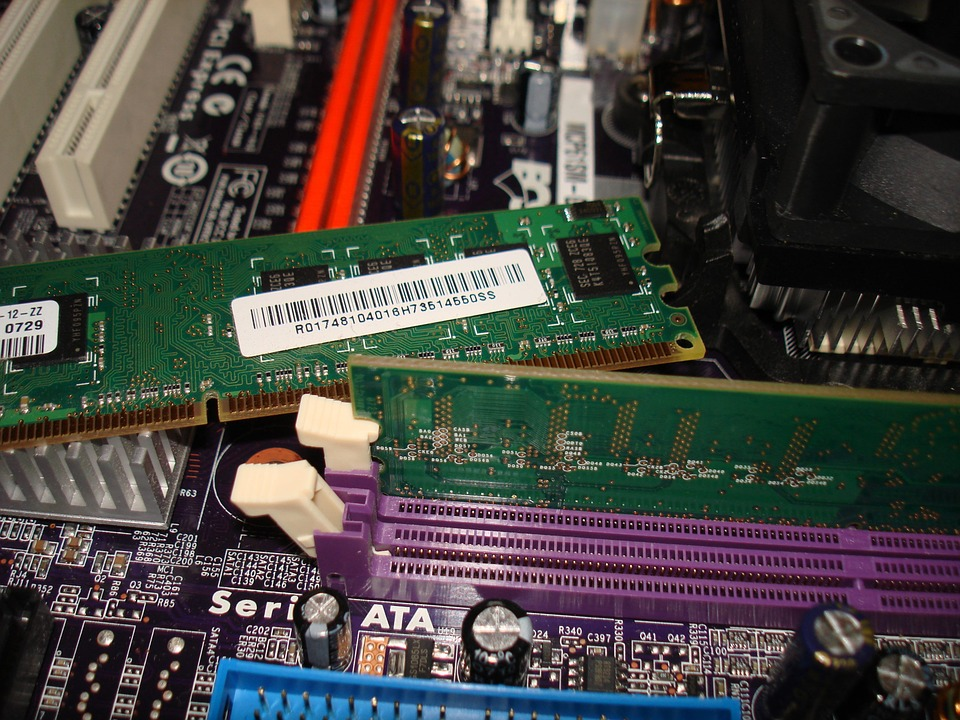

主板上的内存条和内存插槽。图片来源： [Computer Hardware - Free photo on Pixabay](https://pixabay.com/photos/computer-computer-hardware-624558/)

## 硬盘 / Hard Drive

### 硬盘分类

硬盘用于保存数据，包括系统、软件数据，文档数据等，断电后文件不会丢失。主要分为机械硬盘和固态硬盘，以及结合两者的混合硬盘。

- 机械硬盘 / HDD / Hard Drive

- 固态硬盘 / SSD / Solid State Drive
- 固态混合硬盘 / SSHD / Solid State Hybrid Drive

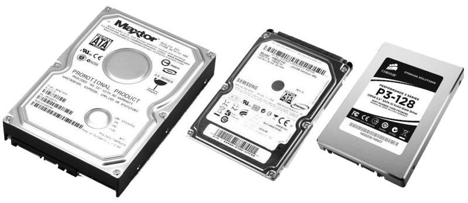

3.5寸机械硬盘、2.5寸机械硬盘、2.5寸固态硬盘，均使用了SATA接口。图片来源： [机械硬盘和固态硬盘的区别和特点 - 知乎 (zhihu.com)](https://zhuanlan.zhihu.com/p/26078269)

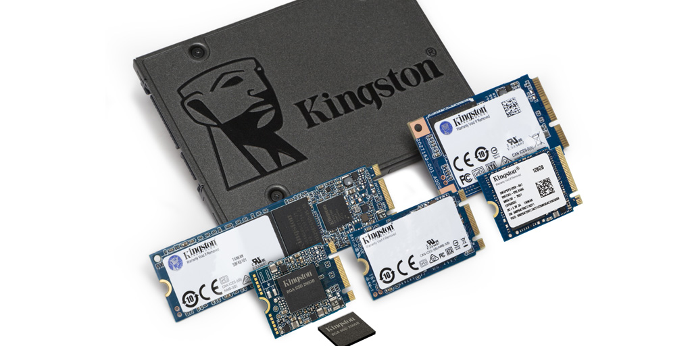

不同规格的固态硬盘。上方是2.5寸SATA接口固态，中间最长的是常见的M2 (M-KEY) 接口、NVMe协议的固态。图片来源： [适用于嵌入式系统和定制系统的固态硬盘 - 金士顿科技 (kingston.com)](https://www.kingston.com/cn/ssd/embedded-purpose-built)

### 机械硬盘与固态硬盘对比

- 机械硬盘：噪音较大，抗震能力更差，速度慢。价格便宜，寿命长，数据安全性相对高，删除数据找回的可能性更大。
- 固态硬盘：速度快，连续读写速度通常高于机械硬盘，IOPS、随机读写能力远比机械硬盘好（简单理解成每秒能进行的读写次数），因为机械硬盘是机械结构，寻址需要花费较长时间。价格昂贵，寿命相对短。

[如何在固态硬盘、固态混合硬盘和传统硬盘之间做出选择，以实现更好的笔记本电脑性能 | Seagate 中国](https://www.seagate.com/cn/zh/do-more/how-to-choose-between-hdd-storage-for-your-laptop-master-dm/)

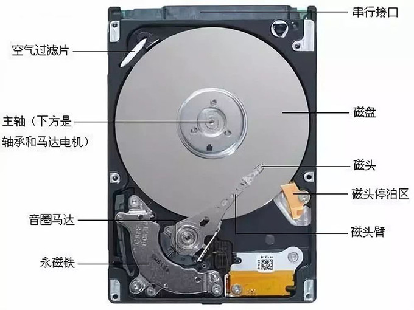

机械硬盘内部构造。图片来源： [机械硬盘还有什么大招能续命？HDD硬盘100TB容量还有大招__什么值得买 (smzdm.com)](https://post.smzdm.com/p/aekempwz/)

### 硬盘接口

目前个人电脑最常见的是SATA和M2 M-Key接口。

- SATA接口：机械硬盘常用SATA接口，部分SSD也用这个接口，**支持热插拔**。SATA3.0传输速度6Gb/s，即600 MB/s。对于机械硬盘完全够用，但是不能完全发挥固态硬盘的性能。
- SAS接口：向下兼容SATA。一般用于服务器，个人电脑用的少。
- M.2接口：M2接口硬盘尺寸比较小。分为M-Key、B-Key两种。M-Key使用NVMe协议，走PCIe通道，速度快，常见的是4通道PCIe，**一般不支持热插拔**。B-Key实际上还是走SATA协议，速度相对慢，只是外观不一样。
- U.2接口：支持NVMe协议，供电能力提高，硬盘使用2.5寸尺寸，体积更大从而可以有更多发挥机会。但是目前支持这个接口的主板和固态都不多。
- PCIe接口：更高性能的硬盘可能直接用PCIe接口。

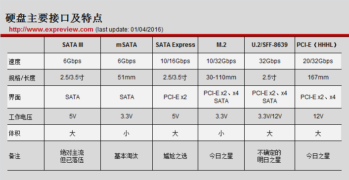

常见硬盘接口对比。图片来源：[超能课堂(25)：M.2、U.2谁更好？主流硬盘接口都有哪些？ - 超能网 (expreview.com)](https://www.expreview.com/44982.html)

[SATA - 维基百科，自由的百科全书 (wikipedia.org)](https://zh.wikipedia.org/wiki/SATA)

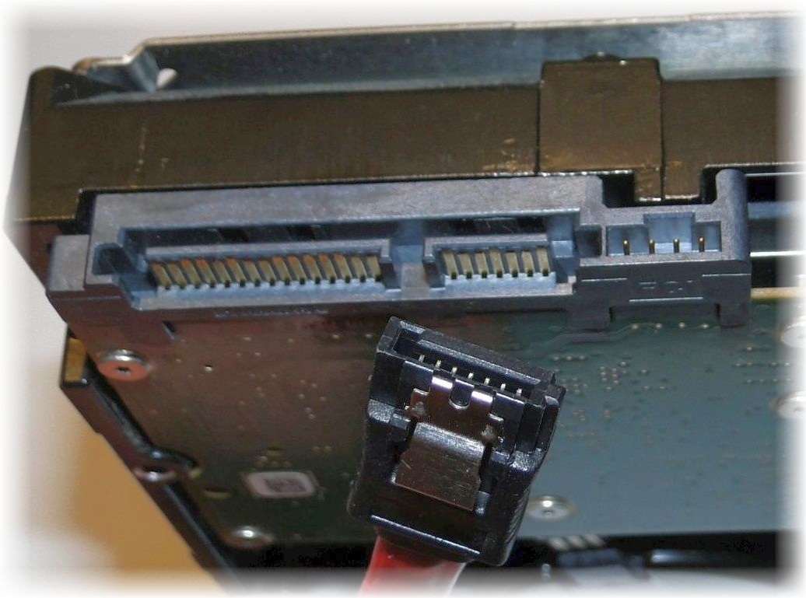

硬盘上的SATA口和SATA数据线。其中宽的15pin是SATA供电口，连接到电源；窄的7pin是SATA数据口，连接到主板；4pin接口是SATA跳线，已经很少用到。图片来源： [SATA interface - Delta (shopdelta.eu)](https://shopdelta.eu/sata-interface_l2_aid809.html)

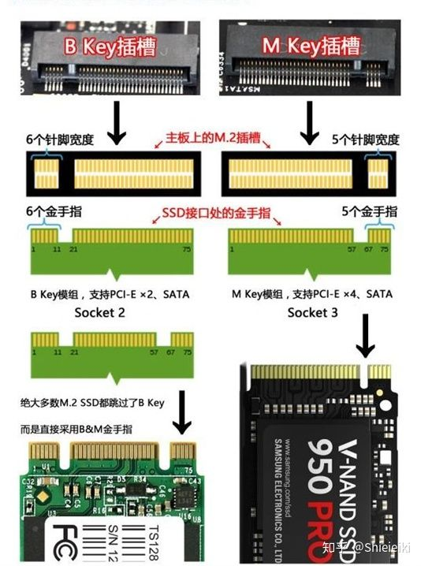

M.2接口。图片来源：[【如何挑选一块合适的固态硬盘】 - 知乎 (zhihu.com)](https://zhuanlan.zhihu.com/p/36900029)

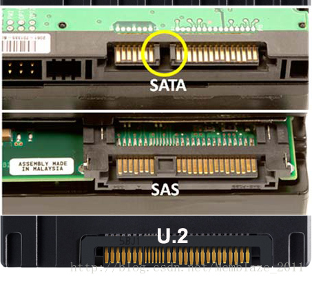

U.2接口。图片来源：[双端口NVMe SSD及其在企业级存储系统中的应用_Memblaze-CSDN博客](https://blog.csdn.net/Memblaze_2011/article/details/78928417)

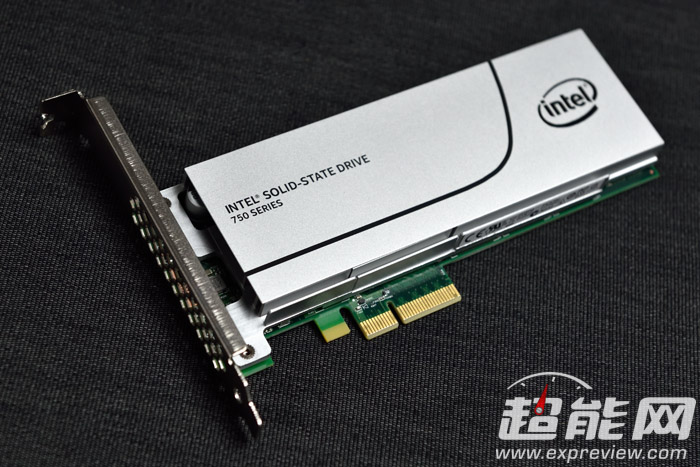

使用PCIe接口的Intel高性能固态硬盘。图片来源：[超能课堂(25)：M.2、U.2谁更好？主流硬盘接口都有哪些？ - 超能网 (expreview.com)](https://www.expreview.com/44982.html)

### 固态硬盘寿命和保修

固态硬盘寿命参数如下，保证在标注的参数范围内硬盘足够可靠，超出范围，硬盘**可能会坏**。

- P/E (Program / Erase)：存储颗粒可以写入的次数。

- TBW (TB Write)：累计可以写入多少TB数据。
- DWPD (Drive Writes Per Day)：保修期范围内，每天可以全盘写入硬盘多少次。

大致的换算方法：例如1TB硬盘，PE=1000，则累计可以写入1000TB，即TBW=1000。保修期算5年，总共可以写1000次，则每天全盘可写入次数 DWPD = 1000 / (365*5) = 0.55。

固态硬盘的保修，常常是结合年限和读写量确定的，例如三星的消费级SSD，通常是5年+标称TBW，两者之一满足就不再保修。

[SSD固态硬盘选购指标-寿命：P/E、TBW 、DWPD - 简书 (jianshu.com)](https://www.jianshu.com/p/ce9edc670de7)

[SSD的P/E和TBW都是什么？又有什么区别？ - 哔哩哔哩专栏 (bilibili.com)](https://www.bilibili.com/read/cv1083087/)

### 固态硬盘存储颗粒

- 主要有SLC、MLC、TLC、QLC，成本依次降低，寿命依次减少。

- 目前市面上消费级产品TLC最多，企业级产品MLC较多。
- 在未来QLC有望实现超大容量超低价格的硬盘，部分取代大容量机械硬盘。

[一篇文章告诉你SLC、MLC、TLC和QLC究竟有啥区别? - 知乎 (zhihu.com)](https://zhuanlan.zhihu.com/p/53547723)

[【TLC固态硬盘的寿命真的那么不堪吗？】 - 知乎 (zhihu.com)](https://zhuanlan.zhihu.com/p/77544563)

### 磁盘阵列 / RAID / Redundant Array of Independent Disks

可以使用磁盘阵列技术，把多块硬盘组成磁盘阵列，实现更快的速度或更高的安全性。举例：

- RAID0：数据分块保存到多个硬盘。读写的时候同时从多个硬盘读写，因此可以实现速度翻倍。注意，机械硬盘组RAID0可以实现连续读写速度超过SSD，但是随机读写速度还是会远不如SSD，因为不能有效缩短寻址时间。
- RAID1：数据同时保存到多块硬盘。只要N个硬盘有一块是好的，数据就不会丢失，适合安全性要求很高的场合。

其他RAID模式参考 [RAID - 维基百科，自由的百科全书 (wikipedia.org)](https://zh.wikipedia.org/wiki/RAID)

### 网络附加存储 / NAS / **N**etwork **A**ttached **S**torage

NAS相当于一个硬盘容量很大的小电脑，专门用于保存数据，其他设备通过网络访问NAS上的数据。

- 局域网内速度足够快时，可以直接挂载NAS分区当本地硬盘使用。例如摄影、视频剪辑用户可以直接用MacBook工作，数据放在NAS里。
- 电视机播放NAS中的高清影视数据。
- 方便的在不同设备之间共享文件。
- 配合互联网，NAS可以提供私有网络云盘、笔记、聊天工具等服务。
- 对于专业用户，还可以做软路由、Git仓库，甚至搭建网站等。

NAS品牌：

- 群晖 / Synology。配套软件全面，开箱即用，适合不想折腾的人。
- 威联通 / QNAP。扩展能力强，可玩性更高，性价比略高于群晖。
- 其他DIY设备，例如蜗牛星际，各种小电脑、台式机等。

### 总结

对于多数用户的建议：

- 容量合适的固态硬盘，用于存放系统、软件等对于速度要求较高的场合。没有重度文件写入需要，所以选择TLC颗粒的SSD就足够了。
- 大容量机械硬盘，用于文件下载、存放文档等需要大量写入或大量存储空间的场合。
- 更多特殊需求，使用RAID和NAS实现。

## 显卡 / Graphics Card / GPU

显卡原本用于处理图形显示，但是因为并行计算能力很强，也被用于机器学习等领域。

### 核心显卡、集成显卡与独立显卡

显卡主要有三种：

- 核心显卡 / Core Graphics Card。集成在CPU内部，Intel / AMD都有带核显的CPU。一般来说顶配的CPU不带核显，原因猜测：一方面核显占用CPU内部空间、需要供电和散热，可能会影响CPU，另一方面CPU已经顶配了，一般也会选择性能相对强的独立显卡。
- 集成显卡 / Integrated Graphics。集成在主板上。一般主板都会有集成声卡，但是不一定有集成显卡。而且由于核显和独显的发展，主板自带显卡越来越少见了。
- 独立显卡 / Dedicated Graphics Card。独立显卡性能最强，是一块独立电路板的形式，连接到主板上。

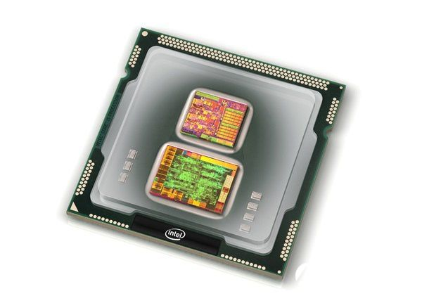

核心显卡封装在CPU内部。图片来源： [Intel核心显卡进化之路：性能6年翻N倍_电脑百事网 (pc841.com)](https://m.pc841.com/tech/computer/69275.html)

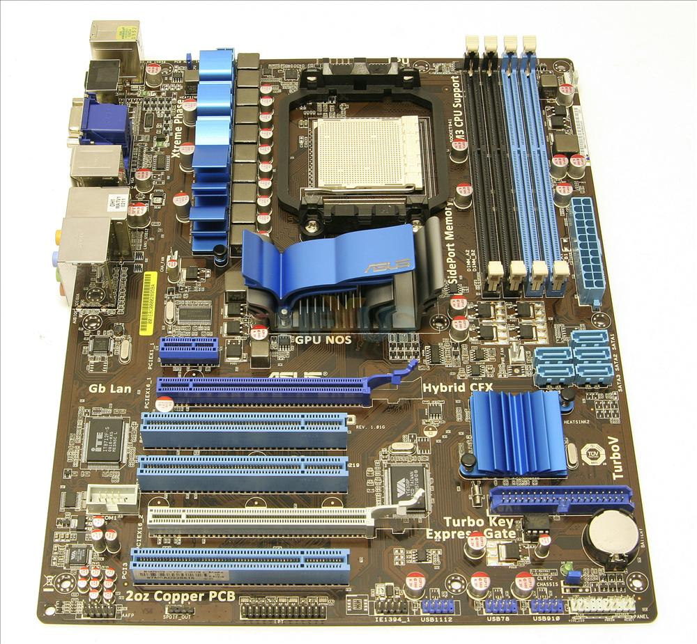

主板上的集成显卡，图中标注了GPU的芯片就是，显卡芯片上装有散热片。图片来源： [Review: AMD 785G chipset. ASUS M4A785TD-V motherboard under the spotlight - Mainboard - HEXUS.net - Page 3](https://m.hexus.net/tech/reviews/mainboard/19568-amd-785g-chipset-asus-m4a785td-v-motherboard-spotlight/?page=3)

主板上安装的独立显卡。 图片来源： [How to Choose a Graphics Card - Newegg Insider](https://www.newegg.com/insider/how-to-choose-graphics-card/)

### GPU与独立显卡

**GPU**是一块很小的芯片，由GPU厂商制造。面向PC的GPU厂商主要有

- NVIDIA
- AMD（前身是ATI，之后被AMD收购）
- Intel，主要制造核显和集显

**显卡**

通常市面上买到的独立显卡，是一块封装了GPU、散热器、供电电路等各种外围设备的电路板，并且使用PCIe接口连接主板。

未安装散热器的显卡，图中最大的芯片即为GPU。下方为PCIe接口。右上角为显卡独立供电口，需要连接电源。图片来源： [Zotac GeForce RTX 2080 Ti AMP 11 GB Review - Circuit Board Analysis | TechPowerUp](https://www.techpowerup.com/review/zotac-geforce-rtx-2080-ti-amp/5.html)

### 公版显卡和非公版显卡

- GPU厂商制造好GPU后，会由更多显卡厂商使用GPU制造显卡。
- GPU厂商一般会自己先设计一套公版显卡，给其他显卡厂商参考。

- 同型号GPU制造的不同型号显卡，由于供电、散热、做工等各方面差异，价格、外观、体积、性能表现也不一样。

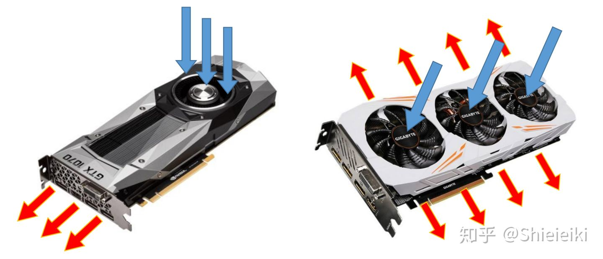

采用涡轮散热的公版显卡，和采用下压式散热的非公版显卡。图片来源： [【公版显卡和非公版显卡有啥区别？】 - 知乎 (zhihu.com)](https://zhuanlan.zhihu.com/p/45816942)

### 跑分

和CPU类似，GPU也有跑分、TDP的问题。

可以在这个网站查看GPU跑分 [PassMark Software - Video Card (GPU) Benchmark Charts (videocardbenchmark.net)](https://www.videocardbenchmark.net/)

### 品牌选择

- 机器学习用NVIDIA的独立显卡较多，因为NVIDIA支持CUDA。

- 如果需要装黑苹果，建议选择Intel或AMD的显卡。苹果系统对NVIDIA的显卡支持很差。据说原因是苹果和NVIDA两家公司闹矛盾。

[为什么做GPU计算，深度学习用amd显卡的很少，基本都nvidia？ - 知乎 (zhihu.com)](https://www.zhihu.com/question/54697898)

[MacBook Pro 为何不在 2016 年使用 Nvidia GPU？ - 知乎 (zhihu.com)](https://www.zhihu.com/question/56458249)

> Apple：“老黄，我想用你们的GPU。滋瓷不滋瓷啊”
> NV：“行啊，卖给你成品芯片，不打折，不定制，驱动我主导”
> Apple：“你当我跟微软一样傻啊，XBox就这么被你骗过还会有人上当？”
> NV：“爱咋咋地，我又不缺人买。老子现在玩机器学习的。”
>
> Apple：“苏女士，我想用你们的GPU。滋瓷不滋瓷啊”
> AMD：“行啊，要怎么打折，要怎么定制，驱动谁主导？”
> Apple：“打不打折以后再说，定制不用太深度，驱动我们主导。这样吧，驱动老没关系。这都是feature知道吗。”
> AMD：“嚄~~~还有这么好的事情，不用怎么改GPU，驱动还有人帮忙！成交！”
>
>
>
> 作者：叛逆者
> 链接：https://www.zhihu.com/question/56458249/answer/149445702
> 来源：知乎
> 著作权归作者所有。商业转载请联系作者获得授权，非商业转载请注明出处。

### 亮机卡

有些用户可能对显卡没有什么要求，能用即可，但是同时CPU不带核显，主板也没有集显，这个时候可以选择买一块比较老、价格便宜的显卡型号，俗称亮机卡，也就是能保证电脑点亮屏幕。

[能否推荐一些性能过得去的亮机卡呢？ - 知乎 (zhihu.com)](https://www.zhihu.com/question/383502195)

## 电源 / Power Supply

### 电源的重要性

一般在组台式机的时候，关注点都集中在性能上了，都比较关心CPU、内存、显卡、主板，可能会对电源缺乏关注。

但是对于一个台式机而言，电源其实非常重要。电源相当于人的肠胃，肠胃不好的人常年消化不良、缺乏营养，这样即使原本智商很高、肌肉发达，也经常会因为身体状况不佳不能发挥实力。

### 电源主要关注参数

- 功率：电源所能输出的最大功率。要保证电源最大输出功率大于CPU、GPU、硬盘等所有设备的功率之和。
- 转换效率：输出功率和输入功率的比值，转换效率的值在0~100%之间。根据转换效率的不同，电源还可以分为钛金牌、铂金牌、金牌、银牌、铜牌几个等级。
- 尺寸：参数接近的电源，体积越小的越贵。一般用标准尺寸的电源，即ATX规格。组装小型台式机，可能会使用SFX、SFX-L等规格的小体积电源。
- 全模组 / 半模组 / 非模组：全模组电源上所有线都是用插座连接的，可以从电源上全部拆下来。如果坏了方便更换，还可以替换不同长度的线。对于追求美观的高端玩家，还可以根据走线定制指定长度的外观的电源线。半模组就是部分线可以拆下来，而非模组则所有线都不能拆卸。一般建议选择全模组电源。
- 品牌：可以参考 [电脑电源用什么品牌好？ - 知乎 (zhihu.com)](https://www.zhihu.com/question/65056501)

[组装电脑：电脑电源推荐 - 知乎 (zhihu.com)](https://zhuanlan.zhihu.com/p/83498194)

[PC电源接口入门篇：如何正确连接？-基础器件-与非网 (eefocus.com)](https://www.eefocus.com/component/472295)

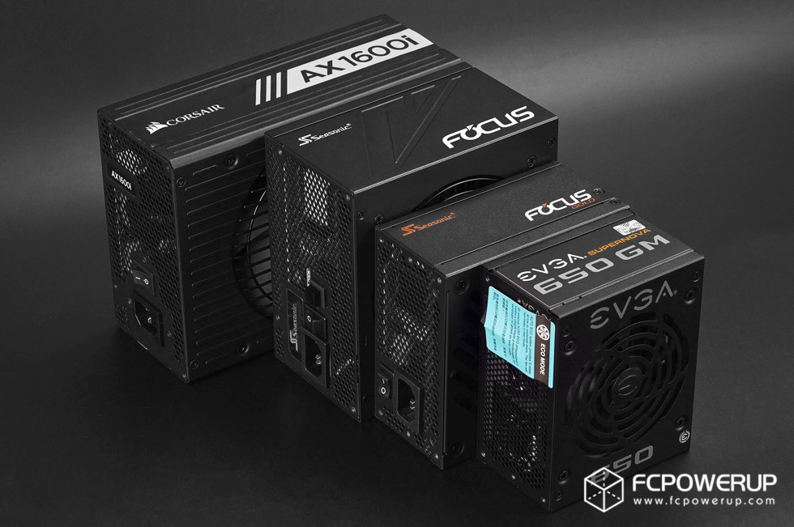

不同规格的电源。图片来源： [ATX/SFX/SFX-L/1U Flex尺寸区别，电源规格尺寸v1.0 – FCPOWERUP极电魔方](https://www.fcpowerup.com/atx-sfx-sfxl-1u-flex-dimension/)

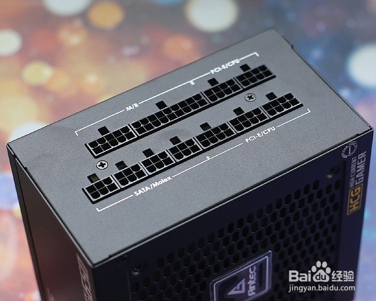

全模组电源上的输出接口。其中M/B为主板供电，8pin用于CPU或PCI-E供电，6pin用于SATA或其他设备供电。图片来源：[全模组电源线路连接体验-百度经验 (baidu.com)](https://jingyan.baidu.com/article/fa4125ac21fd3028ad709245.html)

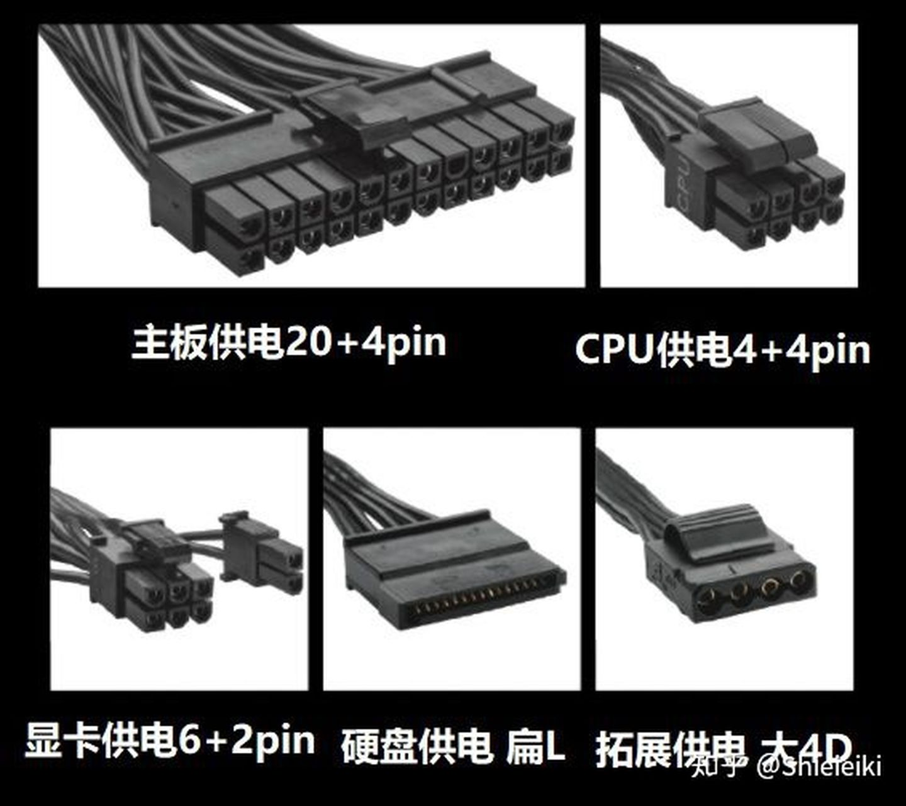

电源线输出接口。包括20+4pin主板供电，4+4pin CPU供电，6+2pin 显卡（PCI-E设备）供电，SATA L口供电，D型4pin万能供电口。图片来源：[【非模组电源，半模组电源，全模组电源有什么区别？】 - 知乎 (zhihu.com)](https://zhuanlan.zhihu.com/p/50797978)

## 散热器 / Cooling System

通常显卡、电源、主板芯片等都有自带的散热器，大部分用户只需要考虑CPU的散热器即可。**这部分先介绍各种散热器的特点，到后面散热一节再具体介绍如何选择。**

热量的传递途径有：

- 热传导
- 热对流
- 热辐射

### 被动散热 / Passive Cooling

- 使用金属散热片将热量从CPU导出（热传导），通过增加和空气接触的表面积加快散热。
- 使用**热管**进一步加快导热。热管是内部填充了低沸点液体的金属管，借助液体的蒸发和冷凝快速转移热量。在笔记本等体积受限的场景下，也会利用热管帮助导热到散热片上散热。
- 对于高热量的现代CPU而言，完全被动散热效果不理想，除非使用很大的散热片，例如整个机箱外壳都是散热片。

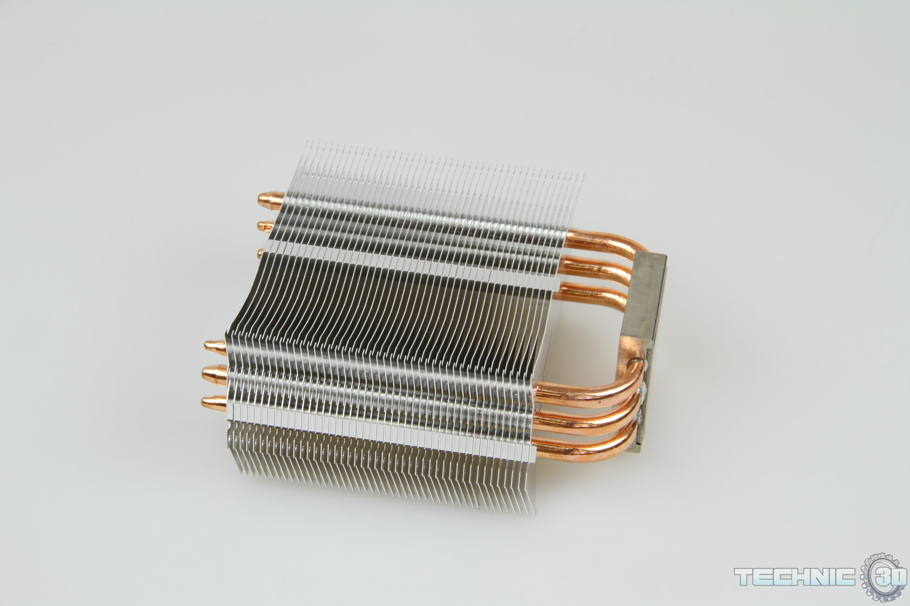

带有3跟热管的散热器。图片来源： [Thermalright True Spirit 90 | Review | Technic3D](https://www.technic3d.com/review/kuehler/1439-thermalright-true-spirit-90/1.htm)

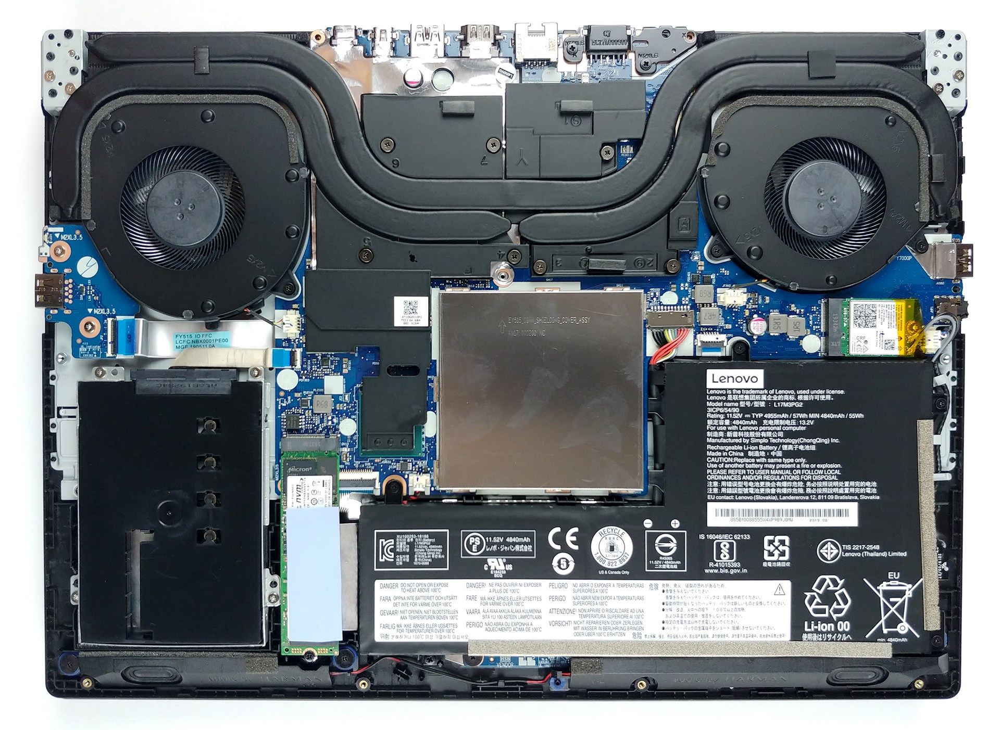

笔记本中的热管。图片来源： [有问有答：什么决定了笔记本的散热好坏？ - 超能网 (expreview.com)](https://www.expreview.com/72255.html)

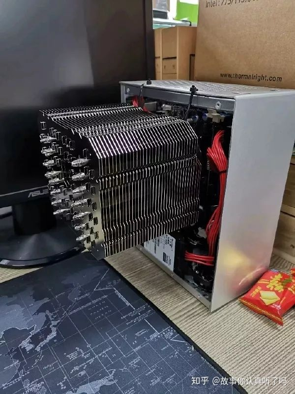

全被动散热。图片来源：[全被动散热且无风扇的静音电脑可以实现吗？- 知乎](https://www.zhihu.com/question/296998101/answer/596517845)

Turemetal发布的无风扇机箱。图片来源：[Turemetal测试RTX 3080显卡无风扇散热方案：350W，87℃](https://finance.sina.com.cn/tech/2021-02-19/doc-ikftpnny7581846.shtml)

官方网站： [Turemetal fanless case 无风扇机箱 官方网站 产品目录](http://www.turemetal.com/product.html)

国外玩家的评测视频： [SILENT 24-core Gaming PC From China - Turemetal UP10 - YouTube](https://www.youtube.com/watch?v=MagpVOMeXlY)

### 风冷散热 / Air Cooling

在被动散热基础上，通过增加风扇促进空气流通（热对流），可以大大增强散热效果。

下面结合图片介绍常见的风冷散热器。

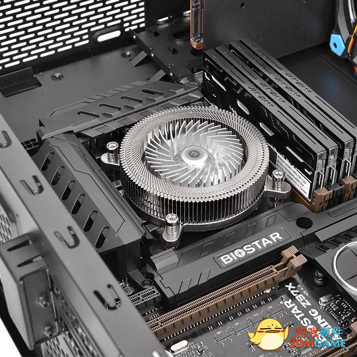

涡轮散热器，使用涡轮风扇散热。体积很小，散热能力较差，噪音偏大。涡轮散热一般用在笔记本、服务器、显卡等需要控制厚度的场合，台式机CPU位置空间充足所以很少使用。图片来源： [超薄、静音！Tt推出新款LGA115X处理器散热器 - 周边设备新闻 - 3DMGAME游戏硬件频道](https://3c.3dmgame.com/show-54-4460-1.html)

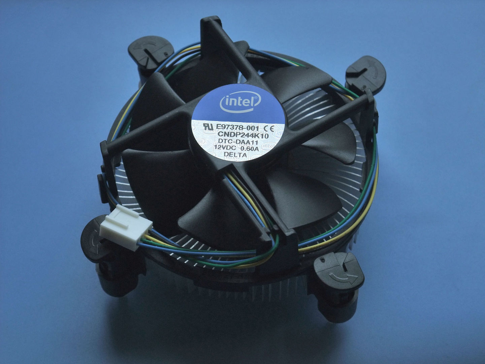

Intel原装CPU散热器，采用下压式散热。下压式散热器的高度较低，散热效果一般。在部分紧凑型台式机箱中由于高度限制，只能使用下压式散热。另外现在市面上很多独立显卡也采用下压式散热。图片来源：[DIY从入门到精通——散热器 - 知乎 (zhihu.com)](https://zhuanlan.zhihu.com/p/21330875)

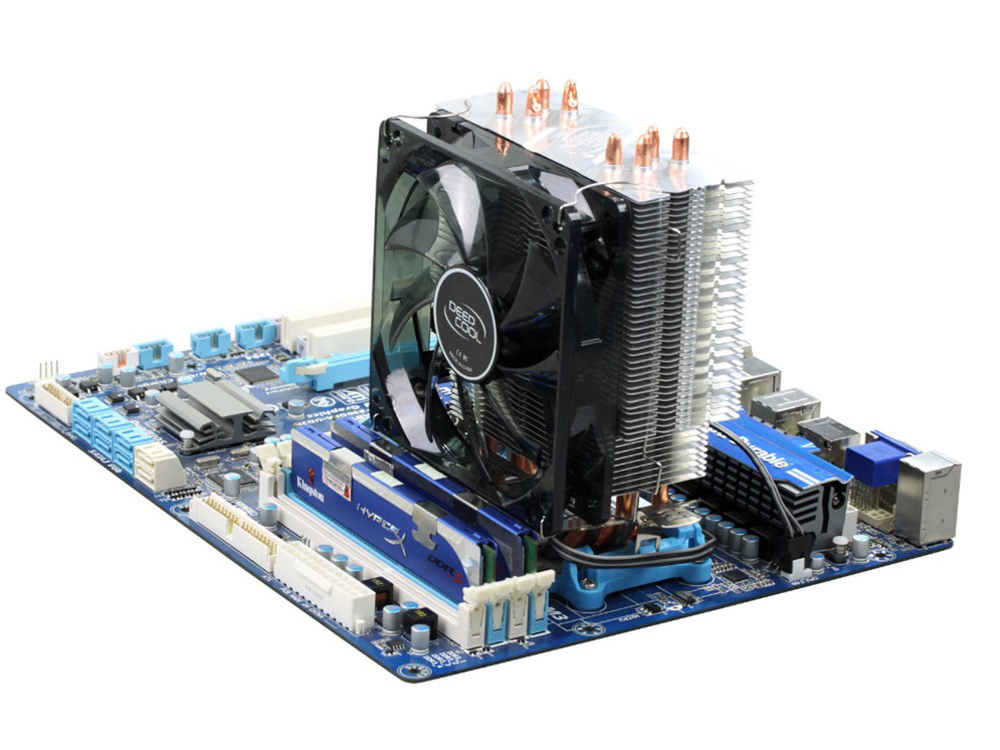

侧吹式散热器，塔式散热，只有单个散热塔因此也称为单塔散热，通常热管越多效果越好。塔式散热器散热效果好，体积大。图片来源：[DIY从入门到精通——散热器 - 知乎 (zhihu.com)](https://zhuanlan.zhihu.com/p/21330875)

公认的顶级风冷：猫头鹰NH-D15，6热管双塔双风扇散热。图片来源： [NH-D15 (noctua.at)](https://noctua.at/en/nh-d15)

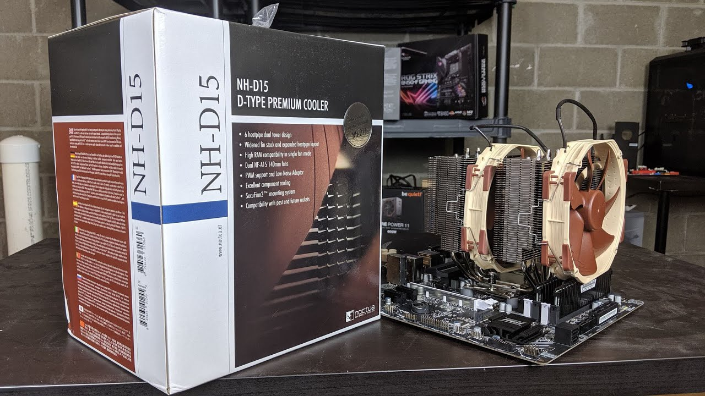

安装在M-ATX主板上的NH-D15，可以看出来体积很夸张。如果内存条过高，可能会和上方的风扇冲突，需要注意散热器的说明。图片来源： [Noctua NH-D15 Unboxing, Overview & Installation LGA 115x & AM4 - YouTube](https://www.youtube.com/watch?v=E6YfbCuszUI)

### 水冷散热 / Water Cooling

热管还是被动将热量从CPU导出的。而水冷则是利用水泵 + 冷却液将热量主动从CPU快速带走，再用风冷方式散热。

#### 水冷主要部件

1. 冷头：和CPU直接接触，冷却液从冷头经过吸收热量。
2. 水排 / 冷排：也就是散热片，冷却液在散热片中经过释放热量。
3. 水管：连接冷头和冷排，冷却液在整个系统中循环使用。
4. 水泵：水泵让冷却液在系统中循环，水泵可能是独立的，也可能和冷头或冷排是一体的。
5. 风扇：加速冷排散热。
6. 冷却液：直接用水，或主要成分是水。
7. 控制器：一些水冷会有独立的控制器，控制水泵、风扇的供电和RGB灯效。

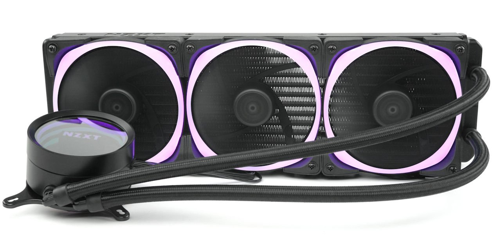

NZXT一体式360水冷。图片来源：[升級 Aer RGB 2 風扇 NZXT Kraken X73 RGB 360mm 一體式水冷 - 電腦領域 HKEPC Hardware - 全港 No.1 PC網站](https://www.hkepc.com/20075/升級_Aer_RGB_2_風扇_NZXT_Kraken_X73_RGB_360mm_一體式水冷)

#### 水冷的特点

相比风冷，水冷有几个优点：

1. 带走热量的效率更高。
2. 热管是金属的，不容易弯曲，因此被动散热器一般都是固定形状，尺寸容易受限。但是水冷可以用软管或定制硬管装水，散热片放到机箱边缘，于是散热片可以做的很大，提高散热速度，降低风扇转速从而减小噪音，机箱内风道也会更加合理（风道后面会讲）。
3. 水的比热容较大，所以对于CPU短时间的高温，水可以直接把热量储存起来，而不至于温度上升过快。

一些常见的担忧：

1. 漏液：水冷有漏液引起短路烧坏电脑的风险，但是随着技术进步，这种问题很少再发生。万一真发生了一般可以申请水冷厂商赔偿。
2. 水泵损坏：水泵有损坏的风险，导致CPU无法散热。但是由于CPU都有过热保护，后果就是立即关机，一般不会烧坏。
3. 冷凝水短路：水冷的原理是带走热量，不会因为散热效果太好导致CPU温度低于室温产生冷凝水，引起CPU短路。
4. 噪音：水泵有一定的噪音，但是现在很多水冷都用了静音水泵，实际上噪音很小，几乎听不见。

#### 水冷的规格

一般根据散热片（冷排）的尺寸，将水冷分为常见的几种规格。其中280使用的是14cm风扇，其他都是12cm风扇。

值得一提的是，**280和360的散热面积其实很接近**，对于追求小体积主机的人很有用，因为支持360水冷的机箱体积不会小。

| 规格 | 尺寸 (mm) | 散热面积 (cm^2) | 风扇直径 (cm) * 数量 |
| ---- | --- | --- | --- |
| 120冷排 | 120*120 | 144 | 12 * 1 |
| 240冷排 | 120*240 | 288 | 12 * 2 |
| 280冷排 | 140*280 | 392 | 14 * 2 |
| 360冷排 | 120*360 | 432 | 12 * 3 |

#### 一体式水冷和分体式水冷

- 一体式水冷适合大多数人，冷头、冷排、水管是不可拆卸的整体。开箱即用，价格便宜，简单可靠。
- 分体式水冷适合高级玩家，每个部件单独购买，可以给多CPU、多GPU整体做定制化的散热系统，水管可以用定制的硬质水管，导热液体需要自己灌装，还可以在液体中加入不同颜色，加装各种配件、灯效等。

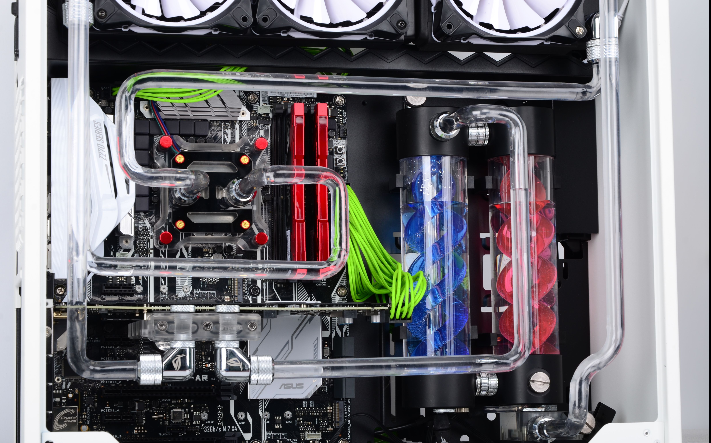

分体式水冷，这里给CPU和GPU都做了散热，并且使用了定制的硬管。图片来源：[风云MOD 迎广303分体式水冷电脑 双病毒水箱RGB变色_哔哩哔哩_bilibili](https://www.bilibili.com/video/av8926361/)

其他分体水冷作品 [GGF 大神 2020年电脑分体水冷总结大赏合集_哔哩哔哩_bilibili](https://www.bilibili.com/video/BV1Rz4y1r7pr)

### 液氮散热

一些极限玩家会使用液氮给CPU散热  [为什么给cpu进行液氮冷却不会热胀冷缩而损坏？ - 知乎 (zhihu.com)](https://www.zhihu.com/question/60708796)

### 浸没式散热 / Immersion Cooling

Computex 2017中，技嘉展出了一款浸没式散热主机。将电路板整个放在不导电的低沸点冷却液中，冷却液沸腾吸收主机热量。

作为一项前沿技术，浸没式水冷已经在服务器领域有所尝试，但是家用还是太困难了。

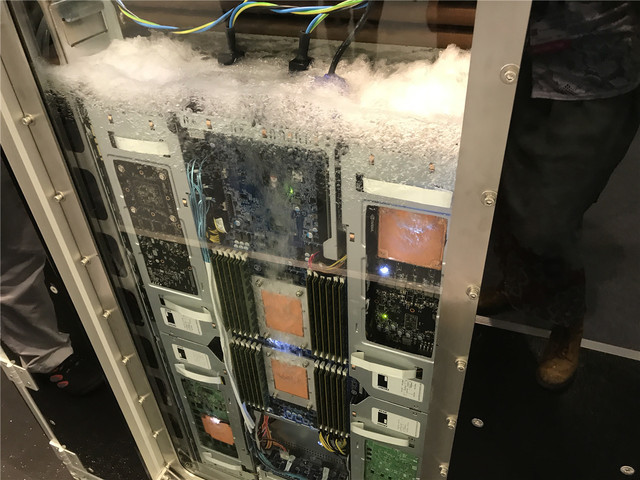

图片来源： [这台烧开水的主机是怎么回事？ (sohu.com)](https://www.sohu.com/a/145223545_535128)

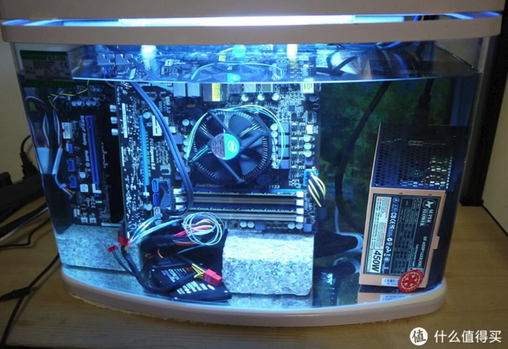

某玩家做的鱼缸甲基硅油主机。图片来源： [3M Novec氟化液，浸没式（全浸式）冷却电脑主机能家用了吗？ - 知乎 (zhihu.com)](https://www.zhihu.com/question/284156826)

## 机箱 / PC Case

### 机箱要考虑的问题

- 外观：根据个人喜好选择。
- 接口：机箱前面板会提供一些接口，例如开关机、指示灯、USB（USB3.0, TypeC），根据需要选择。
- 尺寸：机箱的整体尺寸，以及内部尺寸的计算，是否能装下挑选好的主板、散热器、电源、显卡、硬盘。**如果追求高配置、小体积的主机，就需要做比较细致的计算。如果直接选择标准ATX机箱，则不需要花很多精力计算。**
- 风道和散热：机箱风道对于散热的影响比较大。对于小体积特别是ITX机箱，更需要考虑好风道问题。

### 尺寸规格

和主板类似，机箱也分几种尺寸规格。

- 全塔机箱：支持E-ATX主板
- 中塔机箱：标准机箱，支持ATX主板
- mini机箱：支持M-ATX或ITX主板
- ITX机箱：支持ITX主板

[浅谈组装机机箱的选择（篇一：大小） - 知乎 (zhihu.com)](https://zhuanlan.zhihu.com/p/25592446)

### 机箱结构

**主板的结构决定了CPU风冷散热器、内存、显卡（直插式安装）的相对位置，这对机箱结构设计也产生了一定的限制。**

左图是一个比较经典的家用ATX机箱结构，使用风冷散热，带有光驱位。右图则是一个常见的工作站机箱结构，支持E-ATX主板，多个显卡，以及大量可以从机箱正面热插拔的2.5 / 3.5寸硬盘。

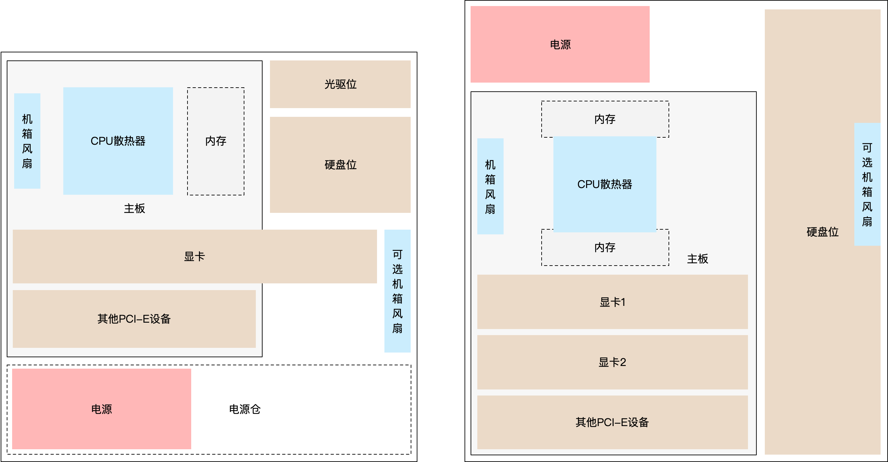

由于技术的发展，CPU功耗越来越大，水冷越来越常见，光驱逐渐被淘汰，机械硬盘容量提升，固态硬盘成本下降，用户**追求体积小巧**的机箱等因素，市面上机箱的结构也发生了变化。家用机箱的光驱位逐渐消失，硬盘位减少，支持水冷成了标配。

下面结合示意图举例，看下市面上常见的机箱是如何逐渐压缩尺寸的。

- 图1：比较标准的中塔机箱，去掉光驱、支持水冷、硬盘位减少。例如海盗船275R、爱国者M2 PRO。
- 图2：主板支持ATX或M-ATX，硬盘位减少并挪到机箱背面，显卡限长，最终减小了机箱长度。例如乔伯斯U3。
- 图3：电源移到右侧，这样显卡可以更长，电源有轻微限长要求。如果不需要更多PCI-E设备，还可以在底部安装硬盘 / 第二个水冷。例如机械大师C34。
- 图4：进一步缩小为M-ATX或ITX主板，只支持一块显卡，结构更加紧凑。例如酷冷至尊NR200（显卡直插安装）。
- 图5：使用水冷或下压式风冷时，CPU上方还有多余空间。于是可以显卡竖装，和主板平行，机箱风扇移到底部或侧面。例如酷冷至尊NR200（显卡竖装）。
- 图6：市面上还有不少A4尺寸的ITX机箱，继续压缩空间，显卡竖装或者直接放到背面。例如小橘优品B1。

小体积机箱的几点总结：

- 体积：**ITX机箱可以达到A4纸的尺寸装进书包里**。
- 性能：可实现带有高配置CPU和独显的台式机，**性能足够强，满足大多数日常需求**。
- 散热：需要合理设计散热，否则就成了所谓的”小闷罐“，造成电脑运行不稳定。
- 价格：需要小体积的电源、显卡，单条容量够大的内存，价格会比标准尺寸的设备高。
- 难度：前期设计、后期安装，都有一定的难度，适合动手能力强的人。

相关视频：

[哪款才是最适合你的A4 ITX机箱？8款A4 ITX机箱评测对比！_哔哩哔哩_bilibili](https://www.bilibili.com/video/BV1ia4y177xh)

 [【机箱横评】10款直插A4 ITX机箱！散热、性价比、颜值大比拼！_哔哩哔哩_bilibili](https://www.bilibili.com/video/BV1pp4y1Y78B)

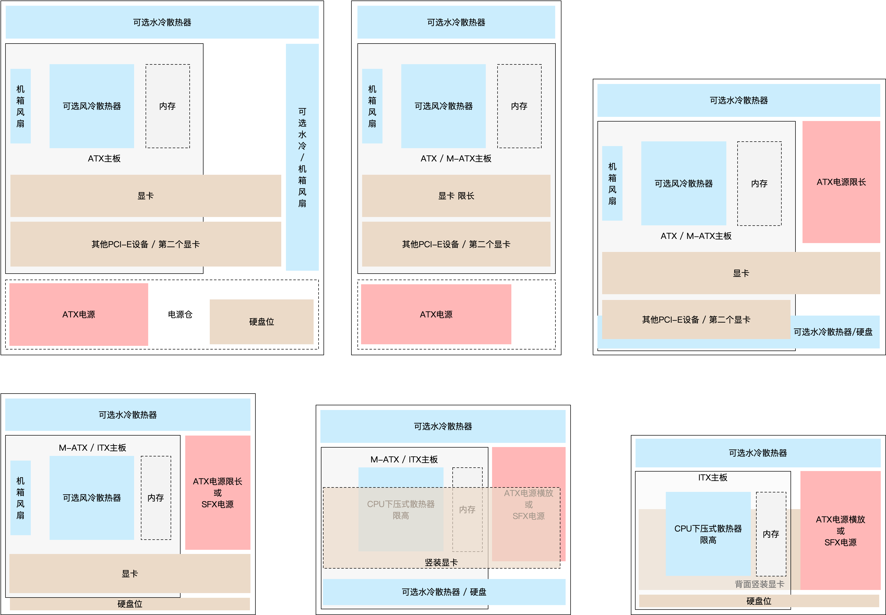

### 机箱内尺寸计算

借助一个比较典型的爱国者M2 PRO中塔机箱示意图为例，分析一下机箱选择的时候要注意哪些尺寸相关的问题，建议购买前详细看产品说明，计算好尺寸，必要时咨询客服。

**主板：**

- 规格：ATX、MATX等规格。不同规格除了尺寸，螺丝孔位也不一样。
- 宽度：极少数特殊主板（通常是E-ATX），宽度会超出常规值，机箱可能放不下。

**水冷：**

- 规格：一般都会注明支持240/360等规格，不同规格螺丝孔位不一样。
- 长度：360水冷实际长度会略超过360mm，需要注意机箱说明。
- 厚度：在一些紧凑的机箱里，水冷的厚度（冷排+风扇）也会有限制，不然会和主板冲突。

**CPU风冷：**

- 限高：由于机箱宽度有限，CPU散热器的高度也会有限制。像猫头鹰的顶级风冷，如果装到一些机箱，侧盖会盖不上。
- 与内存冲突：内存和CPU离得近，有些内存条比较高，还有散热片，CPU风冷底部会和内存冲突，选择风冷时需要注意。

**电源：**

- 规格：通常选择支持ATX电源的机箱+ATX电源即可。
- 长度：紧凑型机箱会限制ATX电源长度。

**2.5 / 3.5寸硬盘：**

- 规格、数量：参考机箱说明即可。

**所有PCI-E设备：**

- 数量、位置：ATX机箱、主板会提供最多7个PCI-E扩展槽位，大型设备例如显卡常常会占用2~3个PCI-E位置。另外考虑到散热，最好不要安装过于密集，结合主板上的槽位考虑。

**显卡：**

- 长度：大型显卡特别是三风扇显卡长度很夸张，但是机箱长度有限，需要考虑。有些机箱前面板可以装水冷或风扇，装上后显卡最大支持长度还会进一步减少。
- 高度：通常显卡高度不会超出机箱宽度，少数很扁的机箱可能会另作说明。
- 厚度：常见的独立显卡会占用2个甚至3个PCI-E槽位，前面已经说了。还有人会给显卡增加PCIe槽位风扇，需要提前考虑好。

**机箱风扇：**

- 风扇直径、数量：机箱可以额外加装风扇促进散热，参考机箱说明。

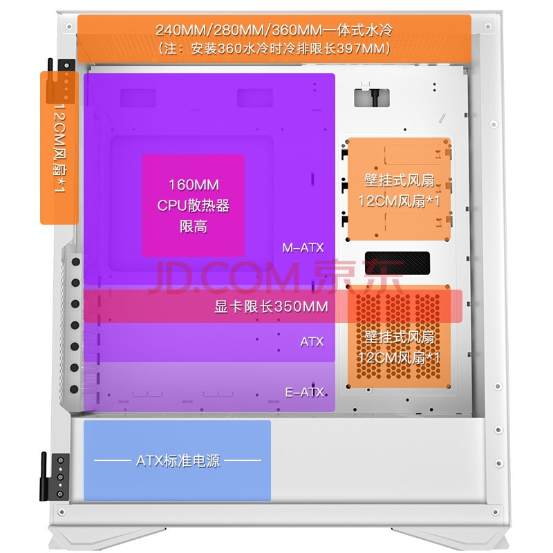

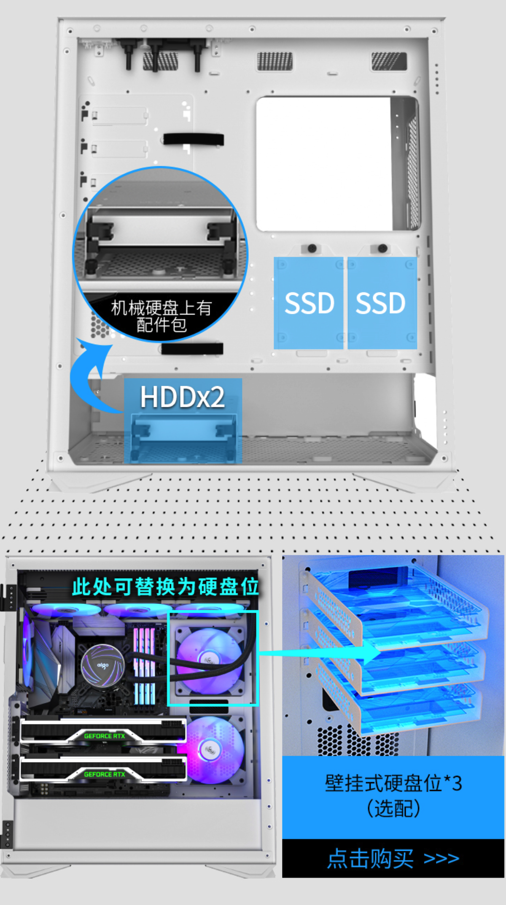

机箱结构与尺寸限制。图片来源： [京东 (jd.com)](https://item.jd.com/100007984845.html)

再举一个例子，机械大师C34机箱，支持ATX主板和ATX电源，设计巧妙紧凑，在配置接近的情况下可以比某些标准机箱减少近一半的体积。但安装难度大，很容易翻车。

具体可以看这个视频 [机械大师-C34视界MATX/ATX机箱装法视频简介_哔哩哔哩_bilibili](https://www.bilibili.com/video/BV1kZ4y1x7XQ)

## 散热与风道设计

### 台式机各种器件如何散热

- CPU：使用风冷或水冷。
- GPU：一般使用显卡上自带的风扇，少数DIY玩家会拆掉显卡原装散热改用水冷。
- 机箱：可以安装机箱风扇辅助散热。
- 其他器件：被动散热，借助机箱空气流通加强散热，少数器件采用独立小风扇。例如电源芯片、SSD、内存条会有散热片，机械硬盘金属外壳可以散热，有些发热量大的南桥芯片，主板上会自带小风扇散热。

### 水冷和风冷的选择

排行

- 散热能力排行：分体软管水冷 > 分体硬管水冷 > 360水冷 > 8热管风冷 > 6热管风冷 = 240水冷 > 4热管风冷 > 120水冷 > 2热管风冷 > 铜柱铝块 > 铝块

- 价格排行：分体水冷 > 一体水冷 > 热管风冷 > 铜柱铝块 > 铝块

- 性价比排行：热管风冷 > 一体水冷 > 软管水冷 > 硬管水冷

参考： [对于电脑散热方式，风冷和水冷哪种好？ - 知乎 (zhihu.com)](https://www.zhihu.com/question/57695465)

对于大多数用户：

1. 不推荐120水冷，效果太差且价格没有优势。
2. 不推荐分体水冷，性价比差且安装难度大。
3. 如果CPU发热较大，推荐240及以上的水冷。
4. 如果CPU发热不是很大，可以考虑风冷。
   - 大型风冷注意机箱限高。
   - 大型风冷注意避免和内存条冲突。解决方法包括：使用高度较小的内存条，更换小直径风扇，选择特殊设计不会和内存条冲突的风冷。
   - 大型风冷重量大，固定在主板上时间久了容易导致主板变形，考虑增加支架。
5. **不同CPU插座不兼容，需要确定风冷、水冷是否支持这个型号。**

### 散热风扇

散热风扇可用于机箱散热或者CPU风冷上的散热，这里有两篇评测文章可以参考：

[Part 4. 市售12cm风扇性能向横测（上）风冷散热器 - 电脑硬件 - Chiphell - 分享与交流用户体验](https://www.chiphell.com/thread-2010881-1-1.html)

[温度噪音的平衡艺术，史上最全的60款风扇横评 - 超能网 (expreview.com)](https://www.expreview.com/20611-all.html)

### 导热硅脂、导热硅胶片

- CPU和散热器的金属面直接接触，可以快速将热量从CPU导出到散热器。

- 但是CPU和散热器接触面会有小空隙，而空气导热效果很差。因此为了促进热传导，需要在接触面之间涂导热硅脂，填充在小空隙里导热。
- 导热硅脂比空气导热好，但比金属导热差。因此不宜涂抹太厚，导致CPU和散热器的金属面无法直接接触。
- 导热硅脂时间太久会干，导热性能下降，最好定期更换，例如一年一次。

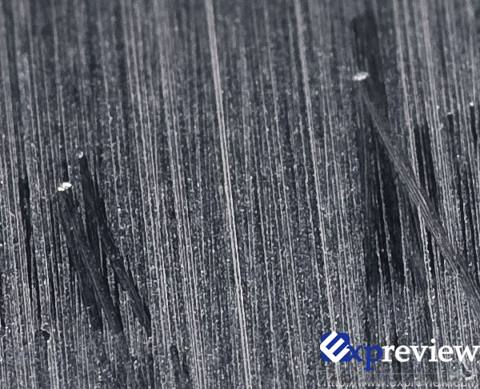

散热器表面放大图，有很多肉眼看不见的凹凸。图片来源： [沙场秋点兵，16款导热硅脂大比武 - 超能网 (expreview.com)](https://www.expreview.com/13-all.html)

导热硅脂涂抹方法示范。图片来源：  [沙场秋点兵，16款导热硅脂大比武 - 超能网 (expreview.com)](https://www.expreview.com/13-all.html)

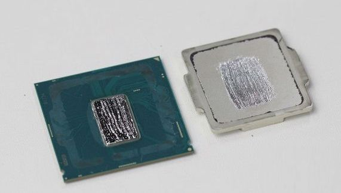

液态金属导热效果更好，但价格贵、容易操作失误导电短路。有些CPU顶盖内部会用到，也有用于CPU和散热器之间导热。图片来源：[什么是液态金属导热剂？ - 知乎 (zhihu.com)](https://zhuanlan.zhihu.com/p/80766960)

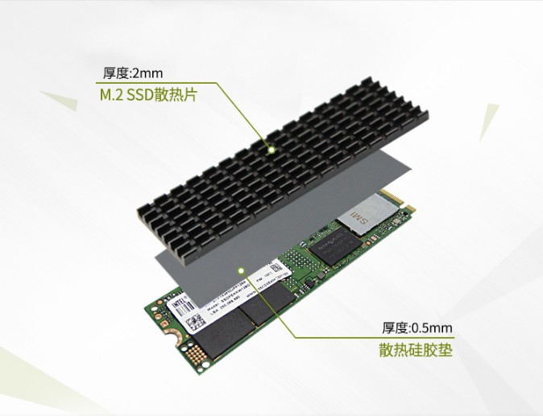

对于SSD等发热较小的设备，可使用导热硅胶片导热，填充高度不一致的器件。图片来源： [淘宝网 (taobao.com)](https://item.taobao.com/item.htm?spm=a230r.1.14.122.6c846107O2Re4b&id=583750643362&ns=1&abbucket=20#detail)

参考：

[沙场秋点兵，16款导热硅脂大比武 - 超能网 (expreview.com)](https://www.expreview.com/13-all.html)

[什么是液态金属导热剂？ - 知乎 (zhihu.com)](https://zhuanlan.zhihu.com/p/80766960)

[安装 CPU 散热器使有必要使用导热硅脂吗？ - 知乎 (zhihu.com)](https://www.zhihu.com/question/376438979)

### 风道

无论风冷还是水冷，最终都是通过风扇带走热量的。在选择机箱和确定机箱内器件分布的过程中，风道是一个需要考虑的关键问题。所谓风道，就是机箱中空气流通的路线。冷空气如何进来，热空气从哪出去。

- 热源：发热最大的是CPU和显卡。

- 流向：空气要按照一定的方向流动，例如从前到后，从下到上。如果是多个风扇吹风的方向冲突，效果会很差。
- 风道长度：风道越短散热效果越好，合理设计风道的情况下，小机箱散热有时候反而有优势。另外水冷的冷排由于直接安装在机箱边缘，风道很短，因此散热效果通常比风冷更好。

- 热空气：热空气密度更小，因此热空气往上方走比较合理，反过来效果就会很差。
- 负压风道与正压风道：负压风道比正压风道效果更好，也就是更多的用风扇将热空气抽出机箱形成负压，而不是把冷空气灌入机箱。因为正压风道排出的不一定是热空气，而在合理位置设置风扇产生负压风道，排出的一定是热空气。
- 如果对机箱外观要求不高，可以直接不装侧盖，散热效果会非常好，CPU温度往往可以降低10~20度。

下图是一个比较常见的机箱风道，冷空气从前方下方进入，热空气从上方后方出来。具体一点：

- 如果是水冷，可以在顶部安装冷排，机箱后方安装一个机箱风扇，前面板可以安装风扇进气。
- 如果是风冷，CPU散热器朝机箱后侧吹风，前后面板和CPU散热器高度接近的地方再装两个风扇分别负责进气和出气，顶部靠后位置可以再加个风扇抽走热空气。

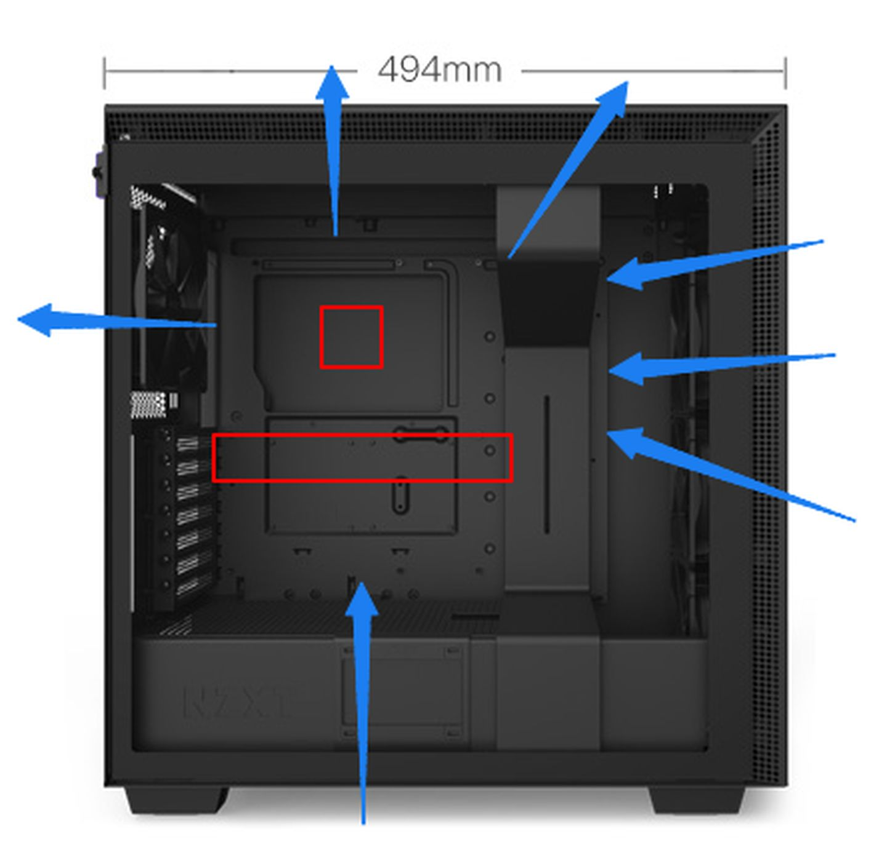

图片来源： [机箱风道设计 - 知乎 (zhihu.com)](https://zhuanlan.zhihu.com/p/293617934)

相关文章： [DIY老司机(1):小编把想到的16种风道都测了一遍-太平洋电脑网 (pconline.com.cn)](https://diy.pconline.com.cn/787/7872761_all.html)

## 噪音问题

1. 机械硬盘。如果不需要大容量存储，可以直接使用SSD。机械硬盘增加垫片防止共振，可以减小噪音。还可以使用NAS存储，放到离人远的地方。
2. 散热风扇。
   - 涡轮风扇转速快的时候噪音很大，台式机主要是显卡可能会使用。
   - 普通风扇转速越快噪音越大，可以选择直径更大的风扇，相同出风量可以降低转速，平衡好散热效果和噪音。
   - 风扇频繁加速减速也会让人更容易察觉到噪音，可以设置主板上的风扇控制功能，让风扇延迟平缓加减速。
   - 不同品牌型号的风扇也有较大差异，一些高级风扇型号可以在相同噪音下取得更大进风量。详见前面的散热风扇一节。
3. 水冷水泵。现在很多水冷用的静音水泵，声音很小，几乎听不见。
4. 静音机箱。静音机箱内部有吸音棉，且机箱结构比较封闭，可以减小噪音。但是体积通常比普通机箱更大。
5. 机箱放在离人比较远的地方，用较长的线连接显示器和键盘鼠标。

## 安装

具体的安装方法可以参考这篇文章的视频教程，配件说明书，还可以根据实际配件型号在网上找到各种视频。

[【装机教程】这可能是你能在网上找到最详细的装机教程 - 知乎 (zhihu.com)](https://zhuanlan.zhihu.com/p/91459238)

一些要点补充：

1. 防呆设计：绝大多数接口都有防呆设计，不会插错烧坏器件。
2. 内存：在安装时需要注意内存先后顺序以及双通道问题。例如4插槽主板，通常1和3、2和4分别组成两组双通道，且优先读取1和3这一组。如果只有2条内存，就应该插到1和3上。具体看主板上的标注和说明书。
3. 供电：主板、CPU、显卡、SATA硬盘，都需要连接电源供电。
4. 支架：大型风冷、大型显卡考虑增加支架，避免长时间压力导致主板变形甚至断裂。
5. 水冷：有些水冷有独立的控制器，水泵和风扇都连接到控制器上。控制器通过USB连接主板，SATA供电线连接电源。
6. 理线：装好了可以整理一下供电线，如果有更高要求，可以定制供电线，指定颜色、长度等参数。

## 配置参考

这里列出两组我实际组装台式机的配置和成本，时间为2021上半年，仅供参考。

配置1：

- 这组配置使用的是正常尺寸的ATX机箱、主板和电源。
- 机箱是侧透式的，实际使用可以直接把侧面有机玻璃盖板拆掉，大大增强散热。

价格合计 7399 + 2649 + 729 + 1449 + 1299 + 269 = ¥13794。

1. CPU+主板套装：AMD 3950x + Gigabyte x570 Aorus Master    ¥7399
2. 内存：海盗船 DDR4 3600MHz 32GBx2套装    ¥2649
3. 硬盘：西数 SN550 1TB   ¥729
4. 水冷：海盗船 H150i ELITE 360水冷   ¥1449
5. 电源：海韵 FOCUS GX-1000 1000W   ¥1299
6. 机箱：爱国者 YOGO M2 PRO   ¥269
7. 风扇：选配机箱风扇，不计入总价格
8. 显卡：盈通GT710-2G D3 战神VC 亮机卡，不计入总价格

配置2：

- 这组配置使用了紧凑型机箱，主板选择M-ATX版本，保证最大仍然可以安装32x4=128GB内存。
- 为了安装上高配置的CPU，散热使用了280水冷，也是小型机箱能支持的最高规格，和360水冷散热面积差距不大。水冷装在机箱顶部，水冷的厚度提前和商家做了确认，确保不会和主板冲突。
- 电源为标准的ATX电源，由于显卡比较短所以不用担心和电源冲突。
- 直接使用了固态硬盘安装在主板上，没有安装机械硬盘。
- 机箱是侧透式的，实际使用可以直接把侧面有机玻璃盖板拆掉，大大增强散热。

价格合计 5699 + 2519 + 649 + 999 + 799 + 909 = ¥11574。

1. CPU+主板套装：AMD 5900x + MSI B550M MORTAR WiFi    ¥5699
2. 内存：海盗船 DDR4 3200MHz 32GBx2套装    ¥2519
3. 硬盘：西数 SN550 1TB    ¥649
4. 水冷：NZXT X63 280水冷    ¥999
5. 电源：海韵 FOCUS GX-750 750W    ¥799
6. 机箱：机械大师C34 黑色AIR MATX版本    ¥909
7. 显卡：已有一块小尺寸GTX1080显卡，不计入总价格
