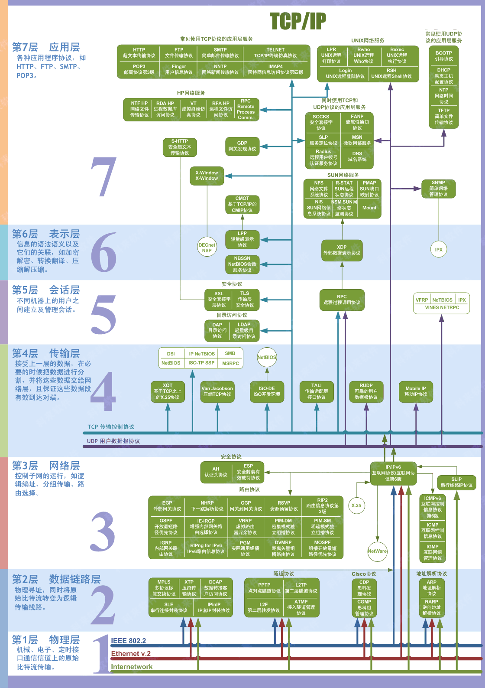
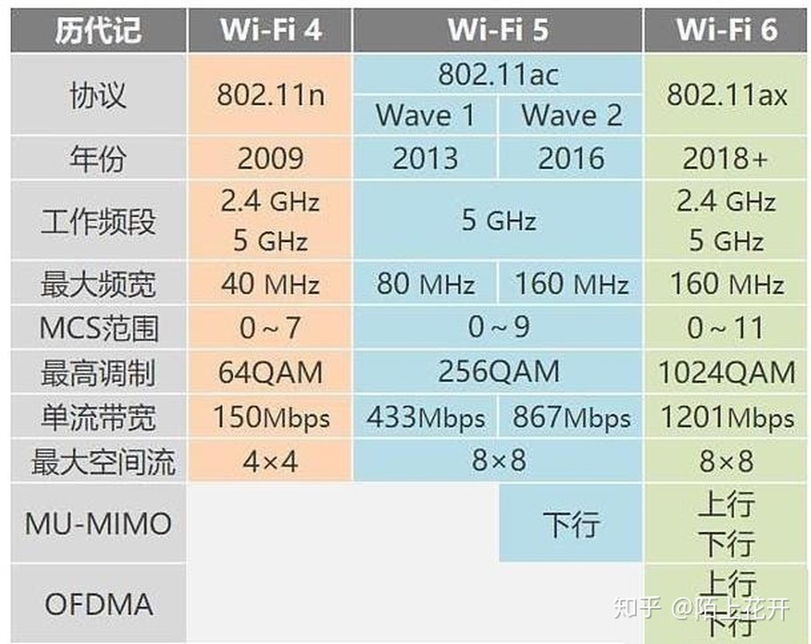

# 网络相关知识


## OSI七层模型



https://blog.csdn.net/qq_39521554/article/details/79894501


## 五层模型

https://www.ruanyifeng.com/blog/2012/05/internet_protocol_suite_part_i.html


1. 物理层：电路连接，电气特性。
2. 数据链路层：广播通信。MAC地址。只有在一个子网才能广播通信。
3. 网络层：主机到主机通信。IP地址，子网掩码，路由。ARP协议（从IP地址得到MAC地址）。
4. 传输层：端口到端口通信。TCP / UDP
5. 应用层：HTTP / FTP / DHCP / DNS / ...


## 网络设备

Hub / 集线器：一般工作在第一层。无源Hub直接连接所有端口；有源Hub会把收到的所有电信号放大并发送出去。智能Hub可能会工作在第二、三层。

> Hub只是一个多端口的信号放大设备，工作中当一个端口接收到数据信号时，由于信号在从源端口到Hub的传输过程中已有了衰减，所以Hub便将该信号进行整形放大，使被衰减的信号再生(恢复)到发送时的状态，紧接着转发到其他所有处于工作状态的端口上。
>
> https://www.163.com/dy/article/F2A2GO2E0511RN54.html

Switch / 交换机：

- 第二层交换机：根据MAC地址转发数据。**通常交换机指的就是二层交换机。**
- 第三层交换机：根据IP地址转发数据，具有部分路由器功能。交换机可以缓存IP和MAC地址对应关系，加速通信。
- 第四层交换机：根据IP和端口转发数据，可以提高服务器群的可靠性和可扩性。第三层交换机处理单一的包，但是第四层交换机可以识别端口信息，将特定业务的包发送给合适的计算机。

https://baike.baidu.com/item/%E7%AC%AC%E5%9B%9B%E5%B1%82%E4%BA%A4%E6%8D%A2

Router / 路由器：一般工作在第三层。路由器可以把网络分割成逻辑上独立的网络单位，使网络具有一定的逻辑结构。路由器的主要工作就是为经过路由器的每个数据帧寻找一条最佳传输路径，并将该数据有效地传送到目的站点。**这里的路由器和常见的家用无线路由器不太一样，家用无线路由器=路由器+交换机+无线AP+拨号等附加功能。**

https://segmentfault.com/a/1190000022099473

AP / Access Point / 无线接入点：有线信号转无线。

- Fit AP / 瘦AP：通常说的AP指瘦AP。相当于无线交换机，不能独立工作，须配合AC集中管理。

- Fat AP / 胖AP：自带操作系统，可以独立工作，需要单独配置。除了AP功能，还具备WAN、LAN端口，支持DHCP，PPPoE等。举例：常用的无线路由器。

https://zhuanlan.zhihu.com/p/64648479

Modem / 调制解调器 / 猫：Modem一般用于转换网络数字信号 和 电话线上的模拟电信号 或 光纤信号。**常见的电信光猫=猫+路由+交换机+无线AP。**


## Bridge / 网桥 与 桥接

Bridge / 网桥：简单理解成二层交换机，但是网桥由软件实现，交换机由硬件实现。

- 路由器的两个LAN口之间为桥接关系。桥设备把数据帧原封不动的在A、B之间发送。
- 无线客户端连接无线网后生成一个逻辑(软件)端口，这个端口和LAN口也是桥接关系。桥接设备需要做有线“**802.3**”与无线“**802.11**”帧格式转换（二层）。

https://www.zhihu.com/question/263496943


## Gateway 网关

网关地址是一个网络通向其他网络的IP地址，网关通常就是路由器。


## 端口映射 / 虚拟服务器

将WAN口指定端口映射到LAN口指定设备的指定端口。


## DMZ主机

路由器的DMZ主机功能，可以把WAN口所有端口映射到指定LAN口设备的对应端口。


## UPNP

自动实现端口映射。

场景：

- 路由器WAN口有公网IP，LAN口接设备，路由器开启UPNP。

- 设备通过UPNP自动在路由器上配置端口转发，从而让公网IP某端口映射到设备的端口。
- 如果设备和公网之间有超过一层路由，UPNP无法正常工作。除非设置DMZ主机。


## DHCP服务器

DHCP服务器用于给新的设备分配IP地址。一个子网有一个DHCP服务器即可，有多个DHCP时可以设置其中一个为强制DHCP，覆盖其他DHCP服务器。

客户端连接DHCP服务器后，DHCP服务器可以下发IP、子网掩码、网关、DNS给客户端（网关和DNS默认为路由器自身IP）。

例如旁路由结构中，要让需要代理的客户端的网关和DNS指向旁路由，可以让主路由或者旁路由作为DHCP服务器下发设置。

https://www.right.com.cn/forum/thread-4035785-1-1.html

https://oeone.cn/archives/486.html


## DDNS

动态域名解析

实际案例：

- 家用网络公网IP一般不是静态地址，每次重新拨号都可能变化
- 想要稳定访问家里的设备，可以用OpenWRT配置DDNS服务
- 每次地址变化，将获取到的公网IP通过API更新到GoDaddy上的特定域名


## 家用路由器工作模式

- AP / Access Point / 访问点：上级路由器的有线LAN转无线。设备在同一个子网，IP由上级路由分配。网线接路由器的WAN和LAN都可以。
- Router / 无线路由：常规的无线路由器模式，WAN口网络进，LAN口和无线设备在新的子网。
- Repeater / 中继：放大Wifi信号，设备在新的子网，SSID相同（存疑）。
- Bridge / 桥接：放大Wifi信号，设备在同一个子网，SSID可以相同可以不同（存疑）。
- Client / 客户端：无线转有线，作为无线网卡使用。无线连Wifi，LAN口连需要上网的设备，设备在新的子网。
- Client Bridge / 客户端网桥：同Client，但设备在同一个子网。


https://zhuanlan.zhihu.com/p/32275116

https://www.tp-link.com/us/support/faq/442/

https://superuser.com/questions/410217/wireless-repeater-vs-wireless-bridge

https://www.zhihu.com/question/20380724/answer/83511160


## 光猫 路由模式 / 桥接模式

路由模式

```
       光纤
        |
  光猫拨号192.168.1.1
        |
主路由WAN口192.168.1.x
主路由LAN口192.168.5.1
        |
  设备192.168.5.x
```

桥接模式

```
光纤 - 光猫192.168.1.1 - 主路由拨号192.168.1.x
                                |
                          设备192.168.1.x
```


## 旁路网关 / 旁路由

```
       光猫
        |
主路由192.168.1.1 - OpenWRT单口旁路由192.168.1.2
        |
 设备192.168.1.x
```

主路由LAN口连接旁路由LAN口，旁路由下的设备在同一个子网。旁路由可提供网关、透明代理、DHCP、DNS等功能。

https://sspai.com/post/59708


## 光猫桥接 + 单臂路由拨号

```
光纤 - 光猫桥接 - 无线路由AP模式 - OpenWRT单臂路由拨号+DHCP
         |           |
      设备连接      电脑连接
```

- 光猫显示光纤EPON模式已连接

- 设备可以无线、有线连光猫，连接后可拨号上网
- IP：
  - 光猫LAN口192.168.1.1
  - 无线路由WAN / LAN口192.168.1.18
  - OpenWRT单臂路由WAN口公网IP，LAN口192.168.5.2

- 当电脑网关改成192.168.1.1，可以访问光猫和无线路由

- 当电脑网关用DHCP默认分配的192.168.5.2，可以上网，不能访问光猫和无线路由

理解（是否准确？）：

- 光猫 - 无线路由 组成 VLAN1（192.168.1.x）
- 无线路由 - OpenWRT - 电脑 组成VLAN2（192.168.5.x）

问题：为什么电脑在VLAN2不能访问光猫和无线路由？因为VLAN2被隔离了？


## WiFi标准

网络标准:
- 802.11a
- 802.11b
- 802.11g
- 802.11n (WiFi 4)
- 802.11ac (WiFi 5)
- 802.11ax (WiFi 6)


**IEEE 802.11 Wi-Fi 协议摘要**

| **协议**       | **频率**     | **通道宽度**       | MIMO             | **最大数据速率 （理论上）** |
| -------------- | ------------ | ------------------ | ---------------- | --------------------------- |
| 802.11ax       | 2.4 或 5GHz  | 20, 40, 80, 160MHz | 多用户 (MU-MIMO) | 2.4 Gbps [1]                |
| 802.11ac wave2 | 5 GHz        | 20, 40, 80, 160MHz | 多用户 (MU-MIMO) | 1.73 Gbps [2]               |
| 802.11ac wave1 | 5 GHz        | 20, 40, 80MHz      | 单用户 (SU MIMO) | 866.7 Mbps [2]              |
| 802.11n        | 2.4 或 5 GHz | 20、40MHz          | 单用户 (SU MIMO) | 450 Mbps [3]                |
| 802.11g        | 2.4 GHz      | 20 MHz             | 不适用           | 54 Mbps                     |
| 802.11a        | 5 GHz        | 20 MHz             | 不适用           | 54 Mbps                     |
| 802.11b        | 2.4 GHz      | 20 MHz             | 不适用           | 11 Mbps                     |
| 传统 802.11    | 2.4 GHz      | 20 MHz             | 不适用           | 2 Mbps                      |

[1] 2 个空间流与 256-QAM 调制。
[2] 2 个空间流与 256-QAM 调制。
[3] 3 个空间流与 64-QAM 调制。

https://www.intel.cn/content/www/cn/zh/support/articles/000005725/wireless/legacy-intel-wireless-products.html





## 无线漫游

家庭的WiFi无线网络部署指南和技巧大全 https://zhuanlan.zhihu.com/p/260443577


### AC + AP 漫游

一个AC+多个AP，AC统一控制所有AP，实现无线漫游。

当设备从AP1信号更好的位置移动到AP2更好的位置，AC可以让AP1把设备踢掉并短时间拒绝设备连接，强迫设备自动重连到AP2。但是重连过程可能会有卡顿。


### Mesh无缝漫游

Mesh组网需要路由器支持802.11 kvr协议，设备支持802.11 r协议。任意两个路由器可以互联，设备可以无缝漫游。

路由器之间的连接通常称为回程，也就是返回到外网的路径，可以有线也可以无线。


如何评价小米路由器 Mesh？真实的体验如何？ https://www.zhihu.com/question/314429987/answer/762502017

Velop MX5300 Mesh路由器全网首发评测 https://zhongce.sina.com.cn/article/view/32515/

隐藏有13根复杂天线，领势MX5300评测 https://zhongce.sina.com.cn/article/view/52633


## Docker的网络模型

Docker的四种网络模型

- bridge：默认。创建虚拟网桥docker0，container连接到这个网桥上，处于独立的子网中。相当于接了一个路由器。外网不能直接访问容器，需要在docker创建容器做端口绑定（`docker run -p 8080:80 xxx`）。
- host：直接使用host的IP和端口，和host共享network namespace（`docker run --network host xxx`）。
- none：创建单独的network namespace，不配置网卡、IP等信息。
- container：和其他容器共享network namespace。

http://shareinto.github.io/2017/07/10/docker-ip/

https://stackoverflow.com/questions/30677702/trouble-running-upnp-on-docker


## IPv6

测试本机IPv6   http://test-ipv6.com/
Ping IPv6  http://www.ipv6now.com.au/pingme.php

### IPv6表示

表示法 X:X:X:X:X:X:X:X，每个X代表16b，即4个16进制字符，8组，总共128b
例如 ABCD:EF01:2345:6789:ABCD:EF01:2345:6789
每个X前面的0可以省略，例如
- 2001:0DB8:0000:0023:0008:0800:200C:417A
- 2001:DB8:0:23:8:800:200C:417A

连续的一段0可以压缩为`::`，但是只能出现一次，保证地址可以正确被解析
- FF01:0:0:0:0:0:0:1101 → FF01::1101
- 0:0:0:0:0:0:0:1 → ::1
- 0:0:0:0:0:0:0:0 → ::

可以将IPv4地址嵌入IPv6，实现IPv4-IPv6互通，IPv4部分用十进制表示
- ::192.168.0.1 与 ::FFFF:192.168.0.1

https://baike.baidu.com/item/IPv6


### IPv6地址类型

IPv6一般有
- 公网IPv6，IPv6 Address，2xxx开头
- 临时IPv6，Temporary IPv6 Address，有效期短
- 本地IPv6，Link-local IPv6 Address，用于内网，fe80开头

Windows关闭临时IPv6： `netsh interface IPv6 set privacy state=disable`

Linux设备运行`ip a`显示的IPv6示例，其中：
- 第一个是公网固定IP，scope global
- 第二个是临时IP，scope global且有dynamic，并显示了剩余时间
- 第三个是本地IP，scope link
(备注：两个xxxx是相同的，被替换掉了，避免公开IP地址)

```bash
inet6 240e:3a1:xxxx:911::8a2/64 scope global
    valid_lft forever preferred_lft forever
inet6 240e:3a1:xxxx:911:211:32ff:fe95:d49e/64 scope global mngtmpaddr dynamic
    valid_lft 5823sec preferred_lft 2222sec
inet6 fe80::211:32ff:fe95:d49e/64 scope link
    valid_lft forever preferred_lft forever
```

展开观察
- 240e:03a1:xxxx:0911:0000:0000:0000:08a2/64
- 240e:03a1:xxxx:0911:0211:32ff:fe95:d49e/64
- fe80:0000:0000:0000:0211:32ff:fe95:d49e/64

参考
https://zh.wikipedia.org/wiki/%E9%93%BE%E8%B7%AF%E6%9C%AC%E5%9C%B0%E5%9C%B0%E5%9D%80
https://post.smzdm.com/p/aqndw6op/
https://cloud.tencent.com/developer/news/586185
https://www.sohu.com/a/416649911_404443
