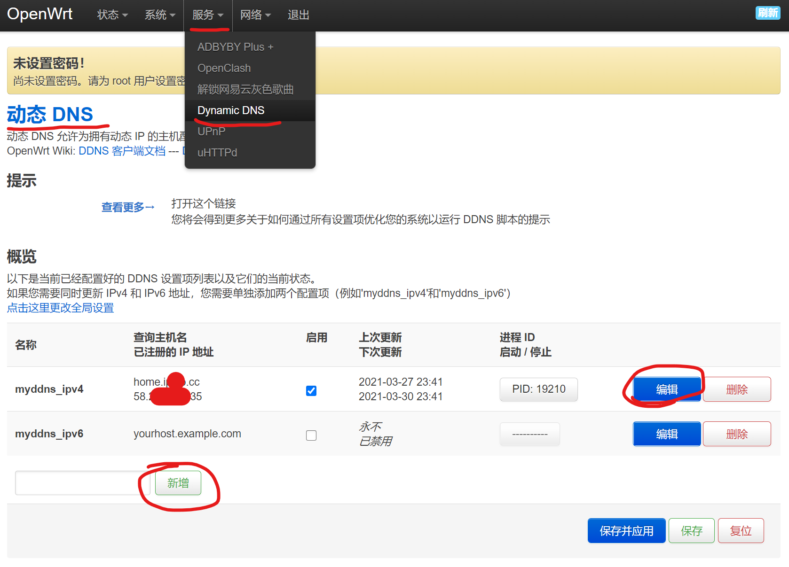
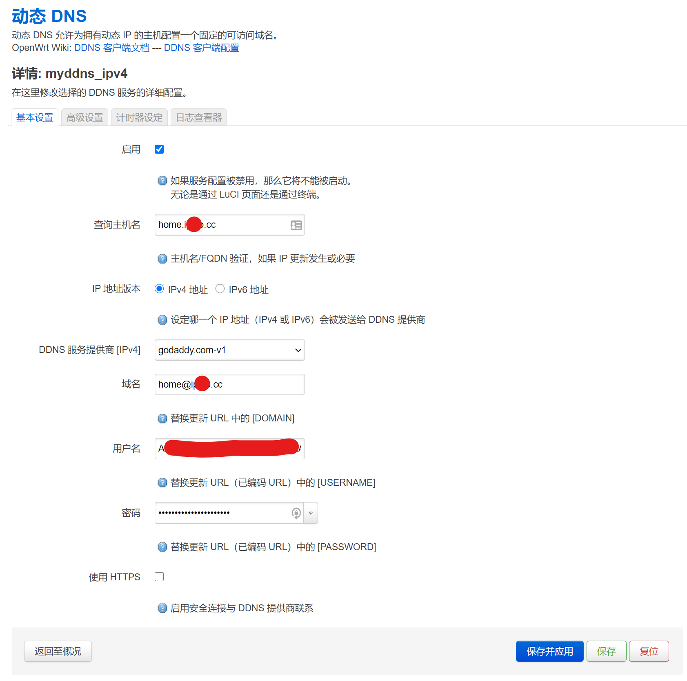
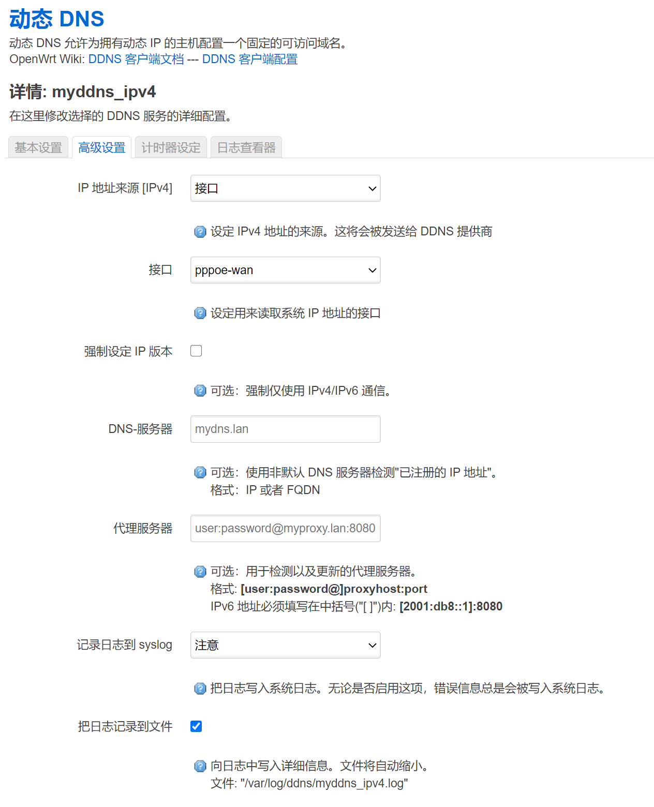
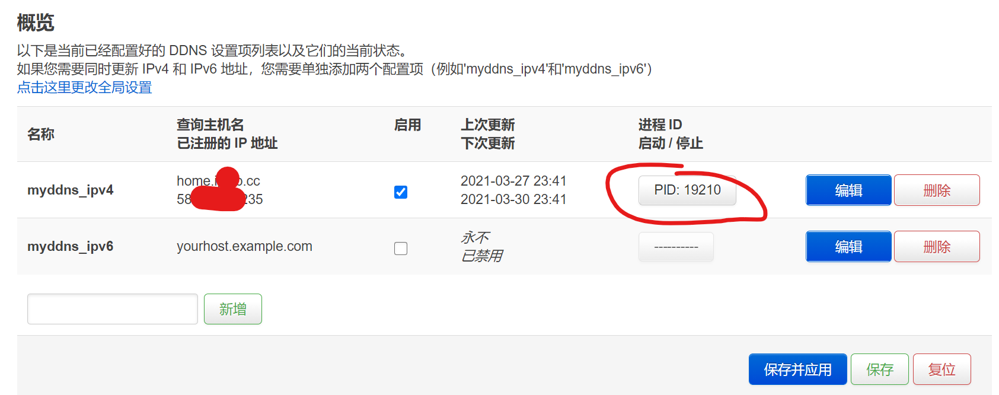

# OpenWRT Godaddy DDNS设置


## 安装DDNS

终端安装，或者自己下载opkg文件在后台安装。

```bash
opkg update
opkg install luci-app-ddns luci-i18n-ddns-zh-cn
opkg install ddns-scripts_godaddy.com-v1
```


## 获取GoDaddy API Key

生成API Key https://developer.godaddy.com/ 并及时保存。Environment选Production。


## 配置OpenWRT

服务 - 动态DNS（如果没有可以尝试重启）- 编辑现有的或者新增配置项。




- 主机名：填完整的域名
- 服务商：选择godaddy
- 域名：要写成 name@yourdomain.com 的形式。如果直接写 yourdomain.com 的形式，会更新 `@` 记录
- 用户名：API Key
- 密码：API Secret




高级设置：如果是OpenWRT自己拨号的，WAN口就是公网，可以把IP地址来源选择为接口`pppoe-wan`，如图所示。如果不是，通常用默认的“网络”即可。

计时器设定可以按需修改。如果工作不正确，可以看看日志查看器。



最后记得保存，并点击启动进程。




## 参考

https://developer.godaddy.com/

https://developer.godaddy.com/doc/endpoint/domains

https://iyzm.net/openwrt/223.html

https://ehye.github.io/2019/01/31/openwrt-godaddy-ddns/

http://blog.sinovale.com/2594.html